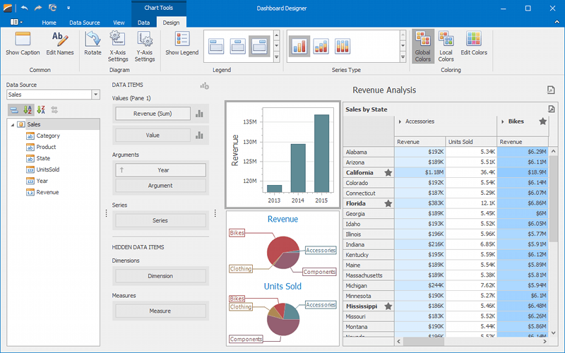

The **Dashboard Designer** provides an intuitive UI that facilitates data binding and shaping, and layout design. Many of these normally complex tasks can be accomplished with a simple drag-and-drop operation, allowing you to start creating dashboards immediately.

## Creating Dashboards
The following topics will guide you through the process of creating a dashboard.
* [Creating a Dashboard](../../dashboard-for-desktop/articles/dashboard-designer/creating-a-dashboard.md)
* [Providing Data](../../dashboard-for-desktop/articles/dashboard-designer/providing-data.md)
* [Working with Data](../../dashboard-for-desktop/articles/dashboard-designer/working-with-data.md)
* [Adding Dashboard Items](../../dashboard-for-desktop/articles/dashboard-designer/adding-dashboard-items.md)
* [Binding Dashboard Items to Data](../../dashboard-for-desktop/articles/dashboard-designer/binding-dashboard-items-to-data.md)
* [Designing Dashboard Items](../../dashboard-for-desktop/articles/dashboard-designer/designing-dashboard-items.md)
* [Data Shaping](../../dashboard-for-desktop/articles/dashboard-designer/data-shaping.md)
* [Interactivity](../../dashboard-for-desktop/articles/dashboard-designer/interactivity.md)
* [Appearance Customization](../../dashboard-for-desktop/articles/dashboard-designer/appearance-customization.md)
* [Data Analysis](../../dashboard-for-desktop/articles/dashboard-designer/data-analysis.md)
* [Converting Dashboard Items](../../dashboard-for-desktop/articles/dashboard-designer/converting-dashboard-items.md)
* [Dashboard Layout](../../dashboard-for-desktop/articles/dashboard-designer/dashboard-layout.md)
* [Undo and Redo Operations](../../dashboard-for-desktop/articles/dashboard-designer/undo-and-redo-operations.md)
* [Automatic and Manual Updates](../../dashboard-for-desktop/articles/dashboard-designer/automatic-and-manual-updates.md)
* [Saving a Dashboard](../../dashboard-for-desktop/articles/dashboard-designer/saving-a-dashboard.md)

## Printing and Exporting
The Dashboard Designer provides the capability to print or export the individual items of a dashboard, as well as the entire dashboard.
* [Printing and Exporting](../../dashboard-for-desktop/articles/dashboard-designer/printing-and-exporting.md)

## UI Elements
The topics in this section describe the main elements of a Dashboard Designer application.
* [UI Elements](../../dashboard-for-desktop/articles/dashboard-designer/ui-elements.md)