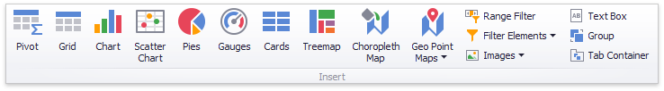

# Add Dashboard Items
To create a dashboard item in the Dashboard Designer, click the corresponding button in the **Home** ribbon tab.

This creates an empty dashboard item, and displays the required data sections for binding this item to data (for instance, the image below displays the [Pivot](dashboard-item-settings/pivot.md) dashboard item and corresponding data sections).

Perform the following steps to design a dashboard item.
* [Bind](bind-dashboard-items-to-data/bind-dashboard-items-to-data.md) the dashboard item to data.
* Perform the required [data shaping](data-shaping.md) operations (such as grouping, sorting and filtering).
* Use the [interactivity](interactivity.md) features to enable interaction between various dashboard items.
* Adjust the dashboard item's [position and size](dashboard-layout/dashboard-items-layout.md) and specify the [dashboard item caption](dashboard-layout/dashboard-item-caption.md) settings.
* Specify specific dashboard item settings based on its type. To learn more, see [Dashboard Item Settings](dashboard-item-settings.md).

After you have created and designed the dashboard item, you can create an exact copy. To do this, click the **Duplicate** button in the **Home** ribbon tab...

... or use the dashboard item's context menu. To remove the dashboard item from the dashboard, use the **Delete** button or the corresponding item in the context menu.