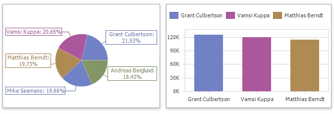
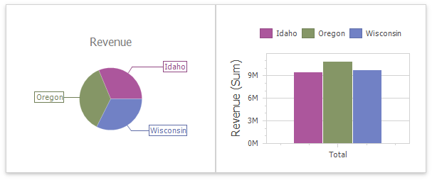
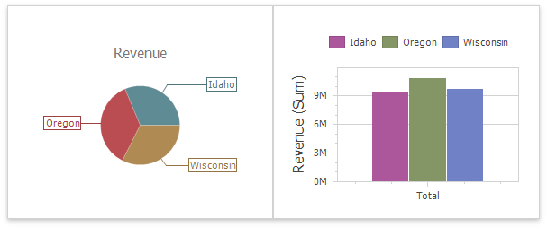

# Coloring
The Dashboard Designer allows you to paint dashboard item elements such as chart series points or pie segments.

## Supported Dashboard Items
You can paint the following [dashboard items](../dashboard-item-settings.md):

* Chart
* Scatter Chart
* Pie
* Pie Map
* Range Filter
* Treemap

## Color Scheme Overview
The dashboard supports two ways to color dashboard item elements:

* A **Global Color Scheme** uses consistent colors for identical values across the dashboard. The image below shows a dashboard that contains Pie and Chart dashboard items. Pie segments and chart series points that correspond to _Wisconsin_, _Oregon_ and _Idaho_ dimension values use identical colors from the default palette.
	
	
	
	 For a global color scheme, the dashboard reserves automatically generated colors for specific values regardless of the filter state.
* A **Local Color Scheme** uses an independent set of colors for each dashboard item. The image below shows Pie segments that use colors from a local color scheme. These colors do not affect the Chart items that use a global scheme.

	
	
	 For a **Local** color scheme, the dashboard reassigns palette colors when the filter state is changed.

>[!TIP]
>**Local** colorization paints dashboard item elements more quickly because the control does not request all possible colors and requests only colors used in the current item.

## Color Measures and Dimensions
You can use predefined color modes to paint individual dimensions or all measures in a dashboard item.

The following color settings are available:

| Color Mode Option | Description |
|---|---|
| **Default** | Enables or disables coloring depending on the dashboard item's type. For example, for TreeMap arguments and Chart series, **Default** means **Hue**. For Chart arguments, **Default** means **None**.  |
| **Hue** | Elements use different colors. |
| **None** | Elements use the same color. |

## Documentation

Refer to the following help topics for more information on how to configure color variation in the WinForms Designer:

* [Coloring Concepts](coloring/coloring-concepts.md)
* [Customizing a Color Scheme](coloring/customizing-a-color-scheme.md) 
