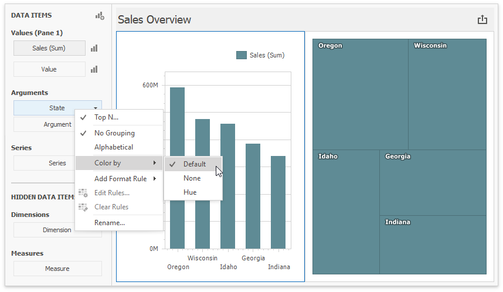

# Coloring 

The Dashboard Designer associates dimension values/measures and specified colors to paint dashboard item elements. This topic describes how to configure color settings in the WinForms Designer.

## Coloring Basics

The following concepts are common to both Desktop and Web Dashboard controls:

* Color Modes
* Color Schemes
* Supported Dashboard Items

Refer to the following topic for more information about common concepts: [Coloring Basics](../coloring.md).

## Color Mode: None 

You can disable default color variation for dashboard item elements.  

If you add a [TreeMap](../../dashboard-item-settings/treemap.md) to a dashboard, individual elements (titles) use different colors: 

_State_ values (Arguments) use different colors. To disable color variation, go to the Argument settings and select **Color by | None**.

Add a [Chart](../../dashboard-item-settings/chart.md) with the same Argument and Value as in the TreeMap: 

Note that **Default** means **None** for chart arguments.  

## Color Mode: Hue 

You can enable colors in previously added Treemap and Chart items.

Set the TreeMap's color mode to **Default** or **Hue**: 

In the Chart settings, move _State_ from Arguments to Series. **Default** now means **Hue** in this new context. The coloring indicator () on the data item shows that color variation by hue is enabled.

Add _Category_ as a chart argument and switch to 100% Stacked View:  

## Use Global Color Scheme 

The same _State_ data items use identical colors. Dashboard constructs a **Global Color Scheme** for this purpose. 

Add a [Range Filter](../../dashboard-item-settings/range-filter.md) with the following settings: 

Corresponding _State_ fields are painted with the same colors, so you can associate and compare data from all dashboard items. This happens because all items use **Global Colors** (the default setting). You can see the switch to **Global Colors** in the Ribbon. Click **Edit Colors** to modify the colors used in the palette:  

> [!NOTE]
> The dashboard uses the default palette. This palette contains 20 unique colors to paint dimension values/measures. For more information on how to change default colors or create a new color table, refer to the following help topic: [Customizing a Color Scheme](customizing-a-color-scheme.md). 

This is how the Dashboard appears after you change the color for *Georgia* in the palette:

## Use Local Color Scheme 

If you want to use an independent set of colors in the selected dashboard item, switch to the **Local Color Scheme**. 

You can see the Treemap's arguments that use colors from the **Local Color Scheme**:  

Colors modified in the local color scheme do not affect items that use the global color scheme. The following image shows a custom color for _Georgia_ in the Treemap:

## Dashboard Item Color Mode Specifics

* [Chart - Coloring](../../dashboard-item-settings/chart/coloring.md)
* [Scatter Chart - Coloring](../../dashboard-item-settings/scatter-chart/coloring.md)
* [Pie - Coloring](../../dashboard-item-settings/pies/coloring.md)
* [Pie Map - Coloring](../../dashboard-item-settings/geo-point-maps/pie-map/coloring.md)
* [Range Filter - Coloring](../../dashboard-item-settings/range-filter/coloring.md)
* [Treemap - Coloring](../../dashboard-item-settings/treemap/coloring.md)

## How to Customize a Color Scheme

Refer to the following topic for more information on how to customize a color scheme:
* [Customizing a Color Scheme](customizing-a-color-scheme.md)
