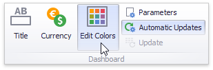

# Customizing a Color Scheme
The Dashboard Designer provides the capability to edit colors contained in [global and local color schemes](coloring-concepts.md). You can select the required color from the default dashboard palette or specify a custom color.
* [Invoke a Color Scheme Dialog](#invoke-a-color-scheme-dialog)
* [Edit Colors](#edit-colors)
* [Add a New Value](#add-a-new-value)
* [Add a New Color Table](#add-a-new-color-table)

## <a name="invoke-a-color-scheme-dialog"/>Invoke a Color Scheme Dialog
To edit colors, use the **Color Scheme** dialog. You can invoke this dialog in the following ways.
* To edit colors in a global color scheme, use the **Edit Colors** button in the **Home** ribbon tab or the **Edit Colors** button in the dashboard item's **Design** tab.
	
	
* To edit colors in a local color scheme, use the **Edit Colors** button in the contextual **Design** ribbon tab.
	
	

Lets consider a Chart dashboard item whose dimensions and measures are colored by hue using local colors.

For this dashboard item, the **Color Scheme** dialog will contain combinations of all dimension values and a specific measure.

In this dialog, you can perform the following actions.
* [Edit automatically assigned colors](#edit-colors) or specify new colors.
* [Add new values](#add-a-new-value) to a color table.
* [Add new color tables](#add-a-new-color-table) containing values whose colors are not yet assigned.

## <a name="edit-colors"/>Edit Colors
You can customize automatically assigned colors in several ways.
* To retain the automatically assigned color for the selected value, right-click the required value in the **Value** column and select **Retain this color**.
	
	
	
	This reserves the current palette color for the selected value.
* You can select another palette color by clicking the required cell in the **Color** column.
	
	
* To specify a custom color, click **More Colors...** and pick any color using the RGB or HSB color model in the invoked **Select Color** dialog.
	
	

You can reset the customized color for the selected value using the **Reset** menu item.

## <a name="add-a-new-value"/>Add a New Value
The **Color Scheme** dialog allows you adding a new value with the specified color to the selected color table. To do this, click the **New Value...** button.

In the invoked **New Value** dialog, specify the dimension values, add the required measures and click **OK**. This creates a new value whose color can be specified as described in [Edit Colors](#edit-colors).

You can remove manually added values using the **Remove** context menu item.

## <a name="add-a-new-color-table"/>Add a New Color Table
The **Color Scheme** dialog also allows you to add a new color table containing values whose colors are not yet assigned. To do this, click **New Color Table...** button.

In the invoked dialog, specify the data source, add the required dimensions and enable the **'MeasureNames' Dimension** check-box if you need to add measures to a color table.

Click **OK** to add the color table to a color scheme. Then, you can add values to this table (see [Add a New Value](#add-a-new-value)) and specify its colors (see [Edit Colors](#edit-colors)).