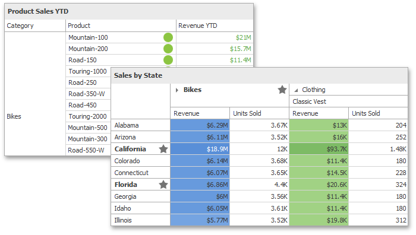
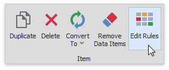
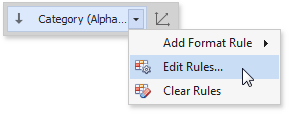
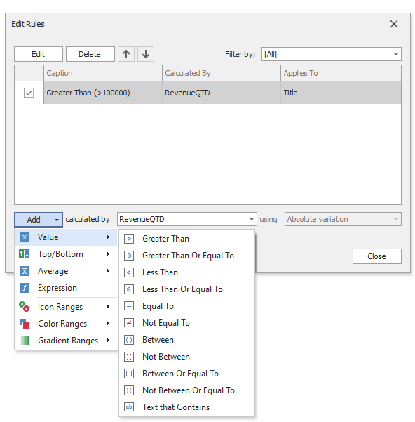
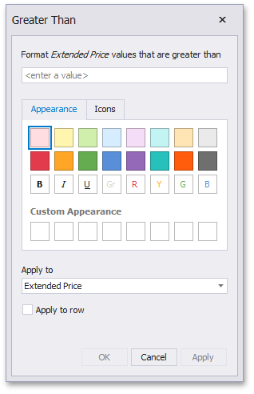

# Conditional Formatting
The Dashboard Designer control supports conditional formatting. You can apply a custom style to data elements that satisfy a certain condition for [Grid](../dashboard-item-settings/grid.md), [Pivot](../dashboard-item-settings/pivot.md), [Chart](../dashboard-item-settings/chart.md), [Scatter Chart](../dashboard-item-settings/scatter-chart.md) and [Card](../dashboard-item-settings/cards.md) items.

## Format Rules
Comparison rules used in conditional formatting can be categorized as follows:
* [Value](conditional-formatting/value.md) - Compares static values (Greater Than, Less Than, Between, etc.).
* [Top-Bottom](conditional-formatting/top-bottom.md) - Highlights a specific number of top/bottom values (Top N, Bottom N).
* [Average](conditional-formatting/average.md) - Highlights values above or below the average value.
* [A Date Occurring](conditional-formatting/a-date-occurring.md) -  Highlights date-time values that are within a specified interval.
* [Expression](conditional-formatting/expression.md) - Uses complex conditions to apply formatting. You can also pass dashboard parameters to expressions.
* [Icon Ranges](conditional-formatting/icon-ranges.md) - Display a specific icon based on a value range. You can select a predefined set of icons or apply a specific icon to each range.
* [Color Ranges](conditional-formatting/color-ranges.md) - Apply specific colors to different value ranges. You can select a predefined set of colors or use custom appearance settings to highlight values within specified ranges.
* [Gradient Ranges](conditional-formatting/gradient-ranges.md) - Apply formatting using gradient color scales.
* [Bar](conditional-formatting/bar.md) - Visualizes numeric values as bars. You can also color bars corresponding to positive and negative values using different colors.
* [Bar Color Ranges](conditional-formatting/bar-color-ranges.md) - Visualize numeric values as bars. Values within a range display a specific color.
* [Bar Gradient Ranges](conditional-formatting/bar-gradient-ranges.md) - Visualize numeric values as bars. Values within a range display a specific bar gradient.

Format conditions that can be applied to different data item types are as follows:
* numeric
	* [Value](conditional-formatting/value.md)
	* [Top-Bottom](conditional-formatting/top-bottom.md)
	* [Average](conditional-formatting/average.md)
	* [Expression](conditional-formatting/expression.md)
	* [Icon Ranges](conditional-formatting/icon-ranges.md)
	* [Color Ranges](conditional-formatting/color-ranges.md)
	* [Gradient Ranges](conditional-formatting/gradient-ranges.md)
	* [Bar](conditional-formatting/bar.md) 
	* [Bar Color Ranges](conditional-formatting/bar-color-ranges.md) 
	* [Bar Gradient Ranges](conditional-formatting/bar-gradient-ranges.md) 
* string 
	* [Value](conditional-formatting/value.md) (with a condition type set to _Equal To_, _Not Equal To_ or _Text that Contains_)
	* [Expression](conditional-formatting/expression.md)
* date-time
	* [Value](conditional-formatting/value.md)
	* [A Date Occurring](conditional-formatting/value.md) (for dimensions with a continuous date-time group interval)
	* [Expression](conditional-formatting/expression.md)
	* [Icon Ranges](conditional-formatting/icon-ranges.md)
	* [Color Ranges](conditional-formatting/color-ranges.md)
	* [Gradient Ranges](conditional-formatting/gradient-ranges.md)
	* [Bar](conditional-formatting/bar.md) 
	* [Bar Color Ranges](conditional-formatting/bar-color-ranges.md) 
	* [Bar Gradient Ranges](conditional-formatting/bar-gradient-ranges.md) 

## Create and Edit a Format Rule

You can create format rules in the following ways:

* Click the **Edit Rules** button on the **Home** ribbon tab. 

  

	This action invokes the [Edit Rules](#the-edit-rules-dialog) dialog where you can create a new format rule or manage rules applied to the dashboard item.

* Click the measure/dimension menu button in the Data Item's pane and select **Add Format Rule**/**Edit Rules**.

	 

    The **Add Format Rule** option invokes the pop-up menu where you can select the format rule and format condition's type for a new rule. 
	
	When you click **Edit Rules**, the [Edit Rules](#the-edit-rules-dialog) dialog appears. You can edit all created format rules for the selected data item in the dialog.

    The **Clear Rules** button clears the rules for the specified data item.

## The Edit Rules Dialog

The **Edit Rules** dialog contains format rules applied to the dashboard item:

You can manage format rules in the dialog in the following ways:

|Action | Description|
|----|-----|
|Edit the selected rule|Use the **Edit** button or double-click the rule. |
|Delete the selected rule|Use the **Delete** button. |
|Reorder format rules|Use the **Up** and **Down** buttons ( and  icons). You can reorder rules to specify their priority. Rules are applied from top to bottom. The bottom rule has the highest priority. |
|Enable/disable a rule|Use the corresponding check box in the left column. |
|Create a new rule|Click the **Add** button and select the format condition. The **calculated by** combo box allows you to select the measure/dimension that is used to calculate the format rule. For Card, when you create a rule for delta, specify the delta type whose values are used to calculate a condition in the **using** combo box. |
|Filter format rules by the specified data item| Use the **Filter by** combo box. |

The **Add** button invokes a pop-up menu where you can specify appearance settings and set the condition's value for the format rule. Available settings depend on the selected format rule.

The image below displays the **Greater Than** dialog, which corresponds to the [Value](conditional-formatting/value.md) format condition for a [Grid](../dashboard-item-settings/grid.md) dashboard item. The format condition applies to the _ExtendedPrice_ data item in the **Apply to** drop-down list.

 
## Dashboard Items Specific

Refer to the following topics for more information about specific format rule settings:
* [Conditional Formatting - Grid](../dashboard-item-settings/grid/conditional-formatting.md)
* [Conditional Formatting - Pivot](../dashboard-item-settings/pivot/conditional-formatting.md)
* [Conditional Formatting - Card](../dashboard-item-settings/cards/conditional-formatting.md)
* [Conditional Formatting - Chart](../dashboard-item-settings/chart/conditional-formatting.md)
* [Conditional Formatting - Scatter Chart](../dashboard-item-settings/scatter-chart/conditional-formatting.md)
 
