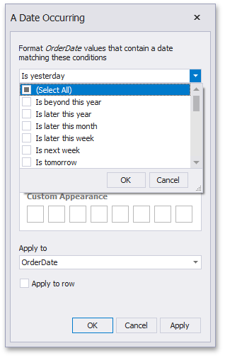

# A Date Occurring
A Date Occurring format condition allows you to highlight date-time values that fall into a specified interval. Note that this format condition can be applied to dimensions with the continuous date-time group interval.

To format values according the Date Occurring condition, click the menu button of the required dimension and select **Add Format Rule | A Date Occurring**.

This invokes the **A Date Occurring** dialog that allows you to select a date-time interval(s) whose value should be formatted.

The following intervals are supported.
* **Is beyond this year** - Dates that follow the current year.
* **Is later this year** - Dates of the current year starting from the following month.
* **Is later this month** - Dates of the current month that follow the next week.
* **Is later this week** - Dates of the current week starting from the day after tomorrow.
* **Is next week** - Dates that belong to the following week.
* **Is tomorrow** - Tomorrow.
* **Is today** - Today.
* **Is yesterday** - Yesterday.
* **Is earlier this week** - Dates of the current week that are prior to yesterday.
* **Is last week** - Dates of the previous week.
* **Is earlier this month** - Dates of the current month that are prior to the previous week.
* **Is earlier this year** - Dates of the current year that are prior to the current month.
* **Is prior to this year** - Dates that are prior to the current year.
* **Empty** - Does not specify any condition.
* **Beyond** - Dates that belong to the month in three-months time and beyond.
* **ThisWeek** - Dates that belong to the current week.
* **ThisMonth** - Dates that belong to the current month.
* **MonthAfter1** - Dates that belong to the following month.
* **MonthAfter2** - Dates that belong to the month in two-months time.
* **MonthAgo1** - Dates that belong to the previous month.
* **MonthAgo2** - Dates that belong to the month two months ago.
* **MonthAgo3** - Dates that belong to the month three months ago.
* **MonthAgo4** - Dates that belong to the month four months ago.
* **MonthAgo5** - Dates that belong to the month five months ago.
* **MonthAgo6** - Dates that belong to the month six months ago.
* **Earlier** - Dates that belong to the month seven months ago and earlier.