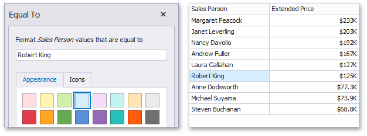

# Value
The **Value** format condition allows you to compare static values (such as Greater Than, Less Than, Between, etc.).

The following condition types are supported for measures or date-time dimensions:
* <a name="greater-than"/>**Greater Than/Greater Than or Equal To**
	
	The "Greater Than"/"Greater Than or Equal To" format conditions allow you to apply formatting to elements whose values are greater than/greater than or equal to the specified value. For instance, the following image displays a Grid dashboard item whose _Extended Price_ cells are filled in green if their values are Greater Than 150 000.
	
	
	
	This format condition can be applied to measures or date-time dimensions.
* <a name="less-than"/>**Less Than/Less Than or Equal To**
	
	The "Less Than"/"Less Than or Equal To" format conditions allow you to apply formatting to elements whose values are less than/less than or equal to the specified value. For instance, the following image displays a Grid dashboard item whose _Extended Price_ cells are filled in red if their values are Less Than 150 000.
	
	
	
	This format condition can be applied to measures or date-time dimensions.
* <a name="equal-to"/>**Equal To/Not Equal To**
	
	The "Equal To"/"Not Equal To" format conditions allow you to apply formatting to elements whose values are equal to/not equal to the specified value. For instance, the following image displays a Grid dashboard item whose _Sales Person_ cells are filled in blue if their values are equal to 'Robert King'.
	
	
	
	This format condition can be applied to measures, string or date-time dimensions.
* <a name="between"/>**Between/Not Between**
	
	The "Between"/"Not Between" format conditions allow you to apply formatting to elements whose values are between/not between the specified values. For instance, the following image displays a Grid dashboard item whose _Extended Price_ cells are filled in orange if their values are Between 100 000 and 200 000.
	
	
	
	This format condition can be applied to measures or date-time dimensions.
* <a name="text-that-contains"/>Text That Contains
	
	The "Text That Contains" format condition allows you to apply formatting to elements whose values contain the specified text. For instance, the following image displays a Grid dashboard item whose _Sales Person_ cells are in cyan if their values contain the 'An' text.
	
	
	
	This format condition can be applied to measures, string or date-time dimensions.