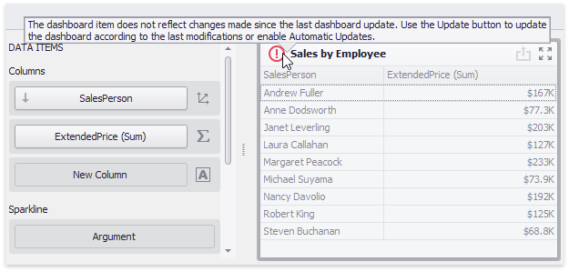
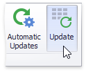

# Automatic and Manual Updates
When you perform a data-aware operation in the Dashboard Designer (for instance, [change the binding](bind-dashboard-items-to-data/bind-dashboard-items-to-data.md) of a specified dashboard item or apply [filtering](data-shaping/filtering.md)), the dashboard sends a query to a data source and updates itself automatically according to the returned data. If the dashboard is bound to a large data source, updating the dashboard according to each change can consume a significant amount of time. In this case, you can disable automatic updates and update the dashboard manually when needed.

Automatic updates are enabled by default and can be managed using the **Automatic Updates** button in the **Home** ribbon tab.

Click this button to disable automatic updates. In this case, the dashboard item will not be updated automatically according to each change. Imagine that you have a Grid dashboard item containing the [dimension](dashboard-item-settings/grid/columns/dimension-column.md) and [measure](dashboard-item-settings/grid/columns/measure-column.md) columns. If you change the [sort order](data-shaping/sorting.md) of the _Sales Person_ column or change the [summary type](data-shaping/summarization.md) of the _Extended Price_ column, the Grid will be shaded and will display the  icon within its caption.

This indicates that this dashboard item requires the update to reflect changes. To update the Grid manually, click the **Update** button in the **Home** ribbon tab.

Note that the state of the **Automatic Updates** option is saved to the [dashboard XML definition](save-a-dashboard.md) but affects only the Dashboard Designer.

> [!NOTE]
> Note that automatic updates are disabled if you click the **Cancel** button on the loading panel when performing a time-consuming operation.