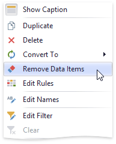

# Bind Dashboard Items to Data
This topic explains how to bind the newly [created](../add-dashboard-items.md) dashboard item to [data source](../provide-data.md) fields, to display data.
* [Binding Concepts](#binding-concepts)
* [Create Binding](#create-binding)
* [Modify Binding](#modify-binding)
* [Clear Binding](#clear-binding)

## <a name="binding-concepts"/>Binding Concepts
To bind dashboard items to data in the Dashboard Designer, the [DATA ITEMS](../ui-elements/data-items-pane.md) pane is used.

Each dashboard item type has a specific set of **data sections**, such as _Values_, _Arguments_ and _Series_ in the chart, _Columns_ and _Sparklines_ in the grid, and _Values_, _Columns_ and _Rows_ in the pivot grid. 
Each data section corresponds to a particular dashboard item area or element, and should be mapped to data to be displayed within this area&#47;element.

Mapping is performed using **data items** - objects that are used to bind a dashboard item to data source fields. Data items are used to link the dashboard item to the required data source fields and, thus, visualize data within the dashboard item.

Another key concept in data binding is the **data item container**, which represents a set of data items. It can contain either a single data item or multiple data items, and allows you to specify various options related to how a [specific dashboard item](../dashboard-item-settings.md) visualizes data.

The data item can process data in two ways - as **dimensions** or **measures**. This depends on the data section to which the data item is assigned, and the type of the data item container.
* **dimension** - a data item whose values are not intended to be summarized.
	
	These values can be of any type - string, date-time or numeric. In any case, the dashboard does not summarize the dimension values, but groups identical values. 
	You can perform [grouping](../data-shaping/grouping.md), [sorting](../data-shaping/sorting.md), or display the [top](../data-shaping/top-n.md) values for the dimension values.
	
	You can also customize [data format](../data-shaping/formatting-data.md) settings for numeric and date-time values. To access the data shaping settings, use the data item's _menu button_.
	
	
	
	For instance, dimensions are used to provide data for the chart argument axis, pivot grid column and row headers.
* **measure** - a data item whose values are summarized before they are used in the dashboard.
	
	These values can be of any type - numeric, date-time or string. In any case, the dashboard will calculate an appropriate [summary](../data-shaping/summarization.md) function against measure values. You can also customize the [data format](../data-shaping/formatting-data.md) settings that affect how summary values are displayed. To access these settings, use the data item's _menu button_.
	
	
	
	For example, measures are used to provide data for the chart's Y-axis, and to calculate pivot cell values.

Specific data sections display _Options buttons_ for each data item container. 
Use these buttons to invoke a dialog that allows you to specify the settings of this data item container. These settings affect how a particular dashboard item's area&#47;element displays the provided data.

## <a name="create-binding"/>Create Binding
The DATA ITEMS pane displays data sections of the selected dashboard item. It can be used to add, rearrange or remove data items.

To bind a dashboard item to data, select the dashboard item. Then choose the required data field from the [Data Source Browser](../ui-elements/data-source-browser.md) and drop it onto the appropriate section in the DATA ITEMS pane.

You can remove the data item by dragging it outside the DATA ITEMS pane.

To learn how to bind a specific dashboard item to data, see the **Providing Data** topic for the required [dashboard item](../dashboard-item-settings.md).

To rename the data item, click its menu button and select **Rename**, to invoke the **Rename Data Item** dialog.

## <a name="modify-binding"/>Modify Binding
You can modify data binding by dragging data item containers within a data section. To do this, drag the data item container to the required position.

You can also modify data binding by dragging data items within the DATA ITEMS pane. This action has the following specifics.
* If you drag the data item to a new position, the settings specified for the corresponding data item container will be restored to the default values.
* If you drag the data item to an existing data item placeholder, the settings of the corresponding data item container will be applied.

## <a name="clear-binding"/>Clear Binding
To remove all data items for a selected dashboard item, use the **Remove Data Items** button in the **Home** ribbon tab.

You can also do this via the dashboard item's context menu.

