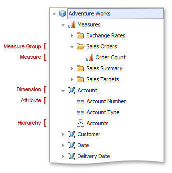

# Binding Dashboard Items to Data in OLAP mode
In **OLAP** mode, the cube schema is fetched automatically, and the [Data Source Browser](../../../../dashboard-for-desktop/articles/dashboard-designer/ui-elements/data-source-browser.md) displays the entire OLAP cube structure.

To visualize data from the OLAP cube, [ drag-and-drop ](../../../../dashboard-for-desktop/articles/dashboard-designer/binding-dashboard-items-to-data/binding-dashboard-items-to-data.md) measures, attributes or hierarchies onto the appropriate data sections in the **DATA ITEMS** area.

Note that OLAP measures can only be placed in the **Values** section, while dimension attributes and hierarchies can only be placed in other data sections.

> By default, the dashboard displays only dimension values that have intersections with measures in a cube. To show all available dimension values, add [hidden measures](../../../../dashboard-for-desktop/articles/dashboard-designer/binding-dashboard-items-to-data/hidden-data-items.md) to the dashboard item so that all dimension values of the dimension will have not be empty for at least one measure value of these measures.

OLAP hierarchies allow you to customize each level separately. To access hierarchy level options, invoke the data item menu for the hierarchy and then use the submenu that corresponds to the desired level.

> You can easily drill down through OLAP hierarchies using the [Drill-Down](../../../../dashboard-for-desktop/articles/dashboard-designer/interactivity/drill-down.md) feature.