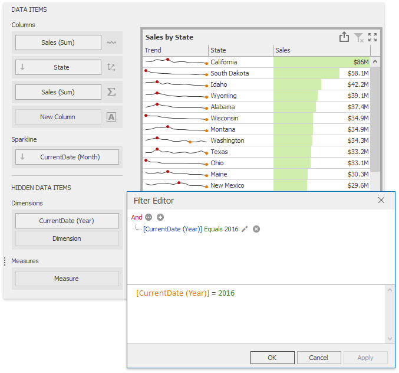
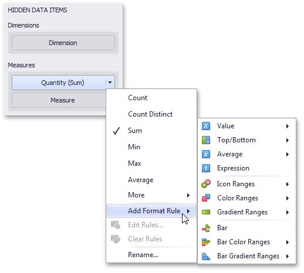

# Hidden Data Items
The **HIDDEN DATA ITEMS** area can be used to perform various [data shaping](../data-shaping.md) and analysis operations by measures or dimensions that do not directly take part in the visual representation of data.

To create hidden data items, choose the required data field from the [Data Source Browser](../ui-elements/data-source-browser.md) and drop it onto the appropriate section in the HIDDEN DATA ITEMS area.

You can perform the following operations using hidden data items.
* [Filtering](#filtering)
* [Sorting](#sorting)
* [Top N](#top-n)
* [Conditional Formatting](#conditional-formatting)

## <a name="filtering"/>Filtering
You can use **hidden dimensions** to [apply filtering](../data-shaping/filtering.md) to the dashboard item. To do this, select the required hidden dimension in the Filter Editor dialog and specify the required condition.

For instance, the [Grid](../dashboard-item-settings/grid.md) on the image above is filtered by the first quarter of the _OrderDate (Quarter)_ dimension.

## <a name="sorting"/>Sorting
You can [sort](../data-shaping/sorting.md) values of the specified dimension by the **hidden measure**. To do this, select the required measure from the dimension's **Sort By** sub-menu.

For instance, categories displayed in the [Grid](../dashboard-item-settings/grid.md) on the image above are sorted by values of the hidden _Quantity (Sum)_ measure.

## <a name="top-n"/>Top N
You can use **hidden measures** in [Top N](../data-shaping/top-n.md) conditions. To do this, select the required measure from the **Measure** combo box in the **Top N Values** dialog.

For instance, the [Grid](../dashboard-item-settings/grid.md) on the image above displays top 5 categories for the _Quantity (Sum)_ hidden measure.

## <a name="conditional-formatting"/>Conditional Formatting
You can create format rules based on **hidden measures** to apply [conditional formatting](../appearance-customization/conditional-formatting.md) to elements corresponding to visible values. To do this, use the **Add Format Rule** menu of the hidden measure.

For the [Expression](../appearance-customization/conditional-formatting/expression.md) format condition, you can use the required hidden measure in the same manner as in the [Filter Editor](#filtering) dialog.