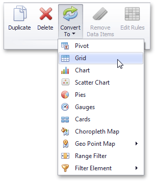

# Converting Dashboard Items
The Dashboard Designer provides the capability to convert data-bound dashboard items to another type. To convert the selected dashboard item to another type, use the **Convert** button in the ribbon's **Home** tab or the corresponding command in the item's context menu.

The Dashboard Designer always preserves the following settings for data-bound dashboard items.
* The set of [data items](../../../dashboard-for-desktop/articles/dashboard-designer/binding-dashboard-items-to-data.md) used to bind the dashboard item to data.
* [Data shaping](../../../dashboard-for-desktop/articles/dashboard-designer/data-shaping.md) settings of data items and their names.
* A custom name displayed within the dashboard item [caption](../../../dashboard-for-desktop/articles/dashboard-designer/dashboard-layout/dashboard-item-caption.md).

The following settings are kept if the dashboard item is being converted to an item that also supports this feature.
* [Master Filtering](../../../dashboard-for-desktop/articles/dashboard-designer/interactivity/master-filtering.md) settings (e.g., the specified master filter mode) and [Drill-Down](../../../dashboard-for-desktop/articles/dashboard-designer/interactivity/drill-down.md) settings (e.g., the target dimension).
* [Conditional Formatting](../../../dashboard-for-desktop/articles/dashboard-designer/appearance-customization/conditional-formatting.md) settings.
* [Coloring](../../../dashboard-for-desktop/articles/dashboard-designer/appearance-customization/coloring.md) settings.
* [Calculation](../../../dashboard-for-desktop/articles/dashboard-designer/data-analysis/window-calculations.md) settings.

For different types of dashboard items, some specific settings can be preserved. For example, the following settings are preserved.
* Legend settings for the [Chart](../../../dashboard-for-desktop/articles/dashboard-designer/designing-dashboard-items/chart.md)/[Scatter Chart](../../../dashboard-for-desktop/articles/dashboard-designer/designing-dashboard-items/scatter-chart.md) dashboard items.
* Series types for the [Chart](../../../dashboard-for-desktop/articles/dashboard-designer/designing-dashboard-items/chart.md)/[Range Filter](../../../dashboard-for-desktop/articles/dashboard-designer/designing-dashboard-items/range-filter.md) dashboard items.
* Element arrangement settings for the [Pie](../../../dashboard-for-desktop/articles/dashboard-designer/designing-dashboard-items/pies.md)/[Card](../../../dashboard-for-desktop/articles/dashboard-designer/designing-dashboard-items/cards.md)/[Gauge](../../../dashboard-for-desktop/articles/dashboard-designer/designing-dashboard-items/gauges.md) dashboard items.
* Caption settings for the [Pie](../../../dashboard-for-desktop/articles/dashboard-designer/designing-dashboard-items/pies.md)/[Gauge](../../../dashboard-for-desktop/articles/dashboard-designer/designing-dashboard-items/gauges.md) dashboard items.
* Navigation settings for [Choropleth Map](../../../dashboard-for-desktop/articles/dashboard-designer/designing-dashboard-items/choropleth-map.md)/[Geo Point Maps](../../../dashboard-for-desktop/articles/dashboard-designer/designing-dashboard-items/geo-point-maps.md).
* The attribute whose values are displayed within shape titles for [Choropleth Map](../../../dashboard-for-desktop/articles/dashboard-designer/designing-dashboard-items/choropleth-map.md)/[Geo Point Maps](../../../dashboard-for-desktop/articles/dashboard-designer/designing-dashboard-items/geo-point-maps.md).
* Legend settings for the [Choropleth Map](../../../dashboard-for-desktop/articles/dashboard-designer/designing-dashboard-items/choropleth-map.md)/[Geo Point Maps](../../../dashboard-for-desktop/articles/dashboard-designer/designing-dashboard-items/geo-point-maps.md).
* [Clustering](../../../dashboard-for-desktop/articles/dashboard-designer/designing-dashboard-items/geo-point-maps/clustering.md) settings for [Geo Point Maps](../../../dashboard-for-desktop/articles/dashboard-designer/designing-dashboard-items/geo-point-maps.md).