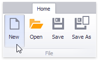

# Creating a Dashboard
When you run an application containing the Dashboard Designer, it already contains an empty dashboard. To create a new dashboard, click the **New** button in the ribbon **Home** tab.

