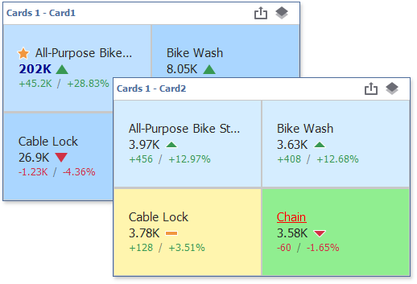

# Conditional Formatting

For a Card dashboard item, you can apply conditional formatting to the card's visual elements (e.g., Title, Subtitle, various values) and change the card's background.

> [!Note]
> Cards that use a [legacy layout](https://docs.devexpress.com/Dashboard/113798/create-dashboards/create-dashboards-in-the-winforms-designer/dashboard-item-settings/cards/layout#legacy-layout-v162-and-earlier) do not support conditional formatting.

## Supported Format Rules

You can use [measure or dimension](../../bind-dashboard-items-to-data/bind-dashboard-items-to-data.md) values to calculate a format rule. You can also use [delta](delta.md) values to calculate a Card dashboard item's format rules.

The following list contains available format rules and corresponding data types:

* numeric
	* [Value](../../appearance-customization/conditional-formatting/value.md)
	* [Top-Bottom](../../appearance-customization/conditional-formatting/top-bottom.md)
	* [Average](../../appearance-customization/conditional-formatting/average.md)
	* [Expression](../../appearance-customization/conditional-formatting/expression.md)
    * [Icon Ranges](../../appearance-customization/conditional-formatting/icon-ranges.md)
	* [Color Ranges](../../appearance-customization/conditional-formatting/color-ranges.md)
	* [Gradient Ranges](../../appearance-customization/conditional-formatting/gradient-ranges.md)
* string 
	* [Value](../../appearance-customization/conditional-formatting/value.md) (with a condition type set to _Equal To_, _Not Equal To_ or _Text that Contains_)
	* [Expression](../../appearance-customization/conditional-formatting/expression.md)
* date-time
	* [Value](../../appearance-customization/conditional-formatting/value.md)
	* [A Date Occurring](../../appearance-customization/conditional-formatting/value.md) (for dimensions with a continuous date-time group interval)
	* [Expression](../../appearance-customization/conditional-formatting/expression.md)
    * [Icon Ranges](../../appearance-customization/conditional-formatting/icon-ranges.md)
	* [Color Ranges](../../appearance-customization/conditional-formatting/color-ranges.md)
	* [Gradient Ranges](../../appearance-customization/conditional-formatting/gradient-ranges.md)

## Create a Format Rule

You can create format rules in the following ways:

* Click the **Edit Rules** button in the **Home** ribbon tab.

   

   The invoked dialog contains the **calculated by** combo box, where you can select the item whose values are used to calculate the format rule. 
    
   * To apply a format rule to a specific card, use delta values to calculate the rule. The [expression](../../appearance-customization/conditional-formatting/expression.md) format condition is an exception to this rule and applies to all cards.
   * To apply a format rule to all cards in a Card item, use hidden measures and series dimensions to calculate the rule.

   For a Card item, the Edit Rules dialog has a **using** combo box. If you use a delta calculation, specify the delta type in this box. Click the **Add** button, select the format rule from the pop-up menu, and specify the rule's condition:

   

* click the series dimension/hidden measure menu button.

    

Refer to the following topic for information on how to create and edit format rules: [Conditional Formatting Common](../../appearance-customization/conditional-formatting.md).    

## Card-Specific Format Condition Settings

Specify appearance settings and set the condition's value for the format rule. Available settings depend on the selected format rule. 

The appearance settings dialog contains the **Apply to** drop-down list. Select a [layout element](layout.md) to which you want to apply a format rule. Select _All elements_ to apply the format rule to all card elements. 

The image below displays the Greater Than dialog that corresponds to the Value format condition. 

The background color applies to the entire card. Note that the **Apply to** drop-down list is not in effect.

Some predefined background styles contain a font color. This font color applies to all card elements regardless of drop-down list settings (for any card layout element).

## Edit a Format Rule

To edit format rules for the current Card dashboard item, use the following options.
* Click the **Edit Rules** button in the **Home** ribbon tab or use a corresponding item in the Card context menu.
* Click the [menu button](../../ui-elements/data-items-pane.md) for the required data item and select **Edit Rules**.

All of these actions invoke the **Edit Rules** dialog that contains existing format rules. For more information, see [Conditional Formatting](../../appearance-customization/conditional-formatting.md).
