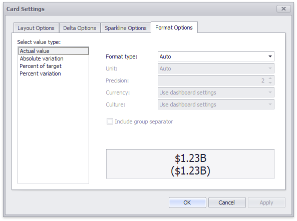

# Formatting
The Card dashboard item formats the [actual and target](providing-data.md) values displayed within cards using [format settings](../../data-shaping/formatting-data.md) specified for data items. Click the options buttons (the  icon) displayed next to the data item container in the **Cards** section to change format settings for other values.

In the invoked **Card Settings** dialog, go to the **Format Options** tab and use the **Select value type** option to specify which values’ format settings should change.

You can change format settings for the following [value types](layout.md):
* **Actual Value**
* **Target Value**
* **Absolute Variation**
* **Percent of Target**
* **Percent Variation**

To learn more about format settings, see **Formatting Numeric Values** in the [Formatting Data](../../data-shaping/formatting-data.md) topic.