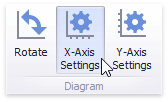
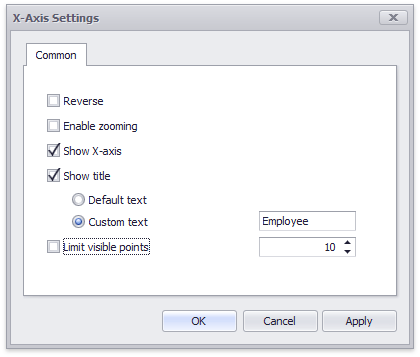
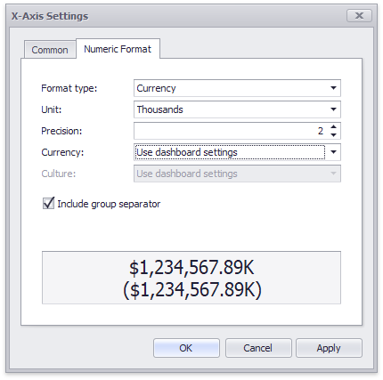
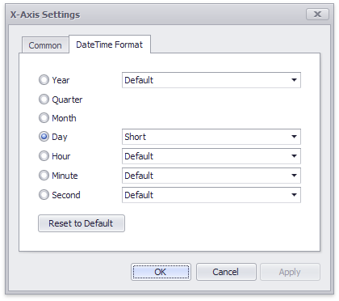
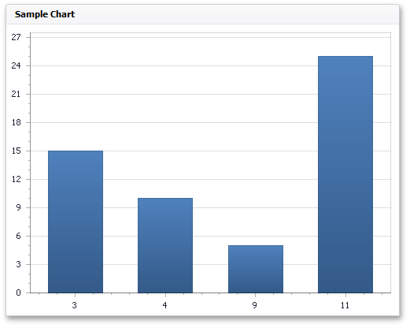

# X-Axis
The **X-axis** is the axis of arguments.

This topic consists of the following sections.
* [Common X-Axis Settings](#generalsettings)
* [Numeric Formats](#numericformatsettings)
* [DateTime Formats](#datetimeformatsettings)
* [Continuous and Discrete X-Axes](#continuousanddiscretexaxes)

## <a name="generalsettings"/>Common X-Axis Settings
To access X-axis settings, use the **X-Axis Settings** button in the **Diagram** section of the **Design** Ribbon tab.

This will invoke the **X-Axis Settings** dialog.

This dialog contains the following settings.

| Setting | Description |
|---|---|
| **Reverse** | Allows you to reverse the X-axis. If the X-axis is reversed, its values are ordered from right to left. |
| **Show X-axis** | Allows you to hide and show the X-axis. |
| **Show title** | Allows you to hide and show the X-axis title. You can choose whether to use the default text or specify a custom string. |
| **Enable zooming** | Allows you to enable zooming for the X-axis. The X-axis' scroll bar provides the capability to perform navigation in the zoomed diagram. |
| **Limit visible points** | Allows you to limit the number of points displayed on the chart's diagram along the X-axis. The X-axis' scroll bar provides the capability to perform navigation if the number of all points exceeds the number of visible points. |

## Numeric Format X-Axis Settings
If arguments are numeric, the **X-Axis Settings** dialog contains a **Numeric Format** tab. It allows you to specify the numeric display formats for X-Axis data, as described in the [Formatting Data](../../../data-shaping/formatting-data.md) document. 

The tab contains the following settings.

* **Format type** - Specifies format types for numeric values. 
* **Unit** - Specifies the unit to convert the numeric values.
* **Precision** - Specifies the number of fractional digits to display.
* **Currency** - Specifies the currency symbol and format provided by the current culture settings.
* **Culture** - Specifies the name of a culture that defines the currency symbol and format.
* **Include group separator** - Specifies whether separators should be inserted between digit groups.

## DateTime Format X-Axis Settings
For date and time arguments, the **X-Axis Settings** dialog displays a **Numeric Format** tab. It allows you to specify the date and time display formats for X-Axis data.

Using the dialog, you can override default formats applied according to the data grouping type, as described in the [Grouping](../../../data-shaping/grouping.md) document. The following image shows the Date Time Format tab in the dialog when the grouping type is set to **Exact Date**. Click the **Reset to Default** button to return all format settings back to their default values.

The tab contains settings described in detail in the [Formatting Data](../../../data-shaping/formatting-data.md) document. 

## <a name="continuousanddiscretexaxes"/>Continuous and Discrete X-Axes
If the dimension in the Arguments section contains numeric data, the Chart can create either a continuous X-axis or a discrete X-axis.

| Continuous X-axis | Discrete X-axis |
|---|---|
| If a continuous axis is used, the distance between argument values is proportional to their values. | On a discrete axis, all argument values are an equal distance from each other. |
|  |  |

To specify the X-axis type in the Designer, invoke the data item menu for the argument dimension and select the axis type.

> [!NOTE]
> Note that the continuous X-axis is not supported in [OLAP](../../../bind-dashboard-items-to-data/bind-dashboard-items-to-data-in-olap-mode.md) mode.