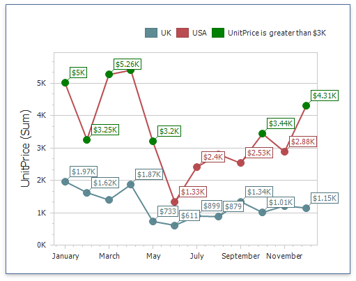
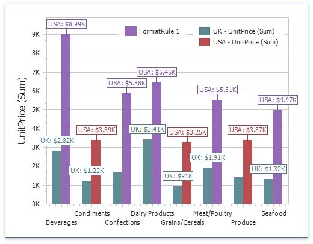

# Conditional Formatting

Use conditional formatting to highlight chart elements such as [bars](series/bar-series.md), [lines](series/point-and-line-series.md), [areas](series/area-series.md), and [data points](series/point-and-line-series.md).

The following series types support conditional formatting:
* [Bar](series/bar-series.md)
* [Point/Line](series/point-and-line-series.md)
* [Area](series/area-series.md)
* [Bubble](series/weighted-series.md)
* [Range Bar](series/range-series.md)

>
## Supported Format Rules

You can use the following data in rule calculations:

- [measures](../../bind-dashboard-items-to-data/bind-dashboard-items-to-data.md) from the **Values** section 
- [dimensions](../../bind-dashboard-items-to-data/bind-dashboard-items-to-data.md) from the **Arguments**/**Series** section 
- hidden measures 

The following list contains available format rules and corresponding data types:

* numeric
	* [Value](../../appearance-customization/conditional-formatting/value.md)
	* [Top-Bottom](../../appearance-customization/conditional-formatting/top-bottom.md)
	* [Average](../../appearance-customization/conditional-formatting/average.md)
	* [Expression](../../appearance-customization/conditional-formatting/expression.md)
	* [Color Ranges](../../appearance-customization/conditional-formatting/color-ranges.md)
	* [Gradient Ranges](../../appearance-customization/conditional-formatting/gradient-ranges.md)
* string 
	* [Value](../../appearance-customization/conditional-formatting/value.md) (with a condition type set to _Equal To_, _Not Equal To_ or _Text that Contains_)
	* [Expression](../../appearance-customization/conditional-formatting/expression.md)
* date-time
	* [Value](../../appearance-customization/conditional-formatting/value.md)
	* [A Date Occurring](../../appearance-customization/conditional-formatting/value.md) (for dimensions with a continuous date-time group interval)
	* [Expression](../../appearance-customization/conditional-formatting/expression.md)
	* [Color Ranges](../../appearance-customization/conditional-formatting/color-ranges.md)
	* [Gradient Ranges](../../appearance-customization/conditional-formatting/gradient-ranges.md)
	
## Create and Edit a Format Rule

You can create and edit format rules in the following ways:

* Click the **Edit Rules** button on the **Home** ribbon tab. 

* Click the measure/dimension menu button in the Data Item's pane and select **Add Format Rule**/**Edit Rules**. 

Refer to the following topic for information on how to create and edit format rules: [Conditional Formatting Common](../../appearance-customization/conditional-formatting.md).

## Chart-Specific Format Condition Settings

Specify appearance settings and set the condition's value to create a format rule. Available settings depend on the selected format condition type.

The image below displays the **Greater Than** dialog (a [Value](../../appearance-customization/conditional-formatting/value.md) format condition applied to a chart). The condition colors points/bars if their values exceed 3000.

Enable **Display in Legend** to add information about the applied rule to the chart. Set the **Caption** field to specify the legend's text. For Range format rules, the legend's text is generated automatically and depends on the range intervals.

Use the **Apply to chart elements** drop-down list to apply a rule to points or lines.

* **Point**: A rule applies to the data points such as bars, points and bubbles.
* **Line/Area**: A rule applies to lines and areas.

The image below displays the Chart item with the applied **Greater Than** format rule. The **Apply to chart elements** option is set to **Point** and the rule is applied to points of the line series. 

If you select **Line/Area**, the format rule applies to the line when at least one line point meets the rule's condition: 

## Coloring

A Chart item paints elements in pale gray if they do not meet the applied format condition. Note that this does not apply to elements that use the [Hue](coloring.md) color mode.

Select the **Color by Hue** option in a Data item's pane to restore the color scheme.

> [!Tip]
> **Documentation:**
> [Chart - Coloring](coloring.md)
