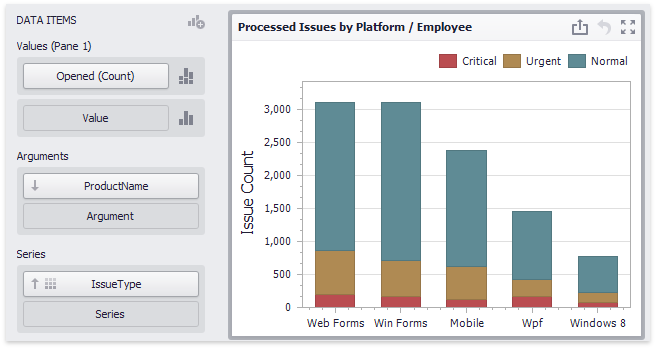

# Providing Data
The Dashboard Designer allows you to bind various dashboard items to data in a virtually uniform manner. To learn more, see the [Bind Dashboard Items to Data](../../bind-dashboard-items-to-data.md) topic.

The only difference is in the data sections that the required dashboard item has. This topic describes how to bind a **Chart** dashboard item to data in the Designer.
* [Binding to Data in the Designer](#bindingdesigner)
* [Transposing Arguments and Series](#transposing)

## <a name="bindingdesigner"/>Binding to Data in the Designer
The image below shows a sample Chart dashboard item that is bound to data.

To bind the Chart dashboard item to data, drag and drop a data source field to a placeholder contained in one of the available data sections. The table below lists and describes the Chart's data sections.

| Section | Description |
|---|---|
| **Values** | Contains data items against which the [Y-coordinates](axes/y-axis.md) of data points are calculated. The _[Options](../../ui-elements/data-items-pane.md)_ button next to the **Value** data item allows you to select the [series type](series/series-overview.md) and specify different options. Note that some types of series accept several measures. To learn more, see the documentation for the required [series type](series/series-overview.md). |
| **Arguments** | Contains data items that provide values displayed along the [X-axis](axes/x-axis.md) of the chart. |
| **Series** | Contains data items whose values are used to create [chart series](series/series-overview.md). |

## <a name="transposing"/>Transposing Arguments and Series
The Chart dashboard item provides the capability to transpose chart arguments and series. In this case, data items contained in the **Arguments** section are moved to the **Series** section, and vice versa.

To transpose the selected Chart dashboard item, use the **Transpose** button in the **Home** ribbon tab.

