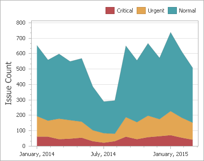
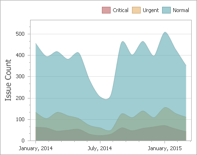

# Area Series
Area series connect numeric data points by different types of line segments and fill the area between the line and X-axis/other series.

The following types of Point and Line series are available.
* [Area](#area)
* [Stacked Area](#stacked-area)
* [Full-Stacked Area](#full-stacked-area)
* [Step Area](#step-area)
* [Spline Area](#spline-area)
* [Stacked Spline Area](#stacked-spline-area)
* [Full-Stacked Spline Area](#full-stacked-spline-area)

## <a name="area"/>Area
Area series connect numeric data points by straight line segments and fill the area between the line and X-axis.

## <a name="stacked-area"/>Stacked Area
Stacked Area series can be used to show the trend of the contribution for each value. Stacked Area series connect numeric data points by straight line segments and fill the area between the line and previous series.

## <a name="full-stacked-area"/>Full-Stacked Area
Full-Stacked Area series are useful to show the trend of the percentage for each value.

## <a name="step-area"/>Step Area
Step Area series use vertical and horizontal lines to connect the numeric data points forming a step-like progression and fill the area between the line and X-axis.

## <a name="spline-area"/>Spline Area
Spline Area series plot a fitted curve through each numeric data point and fill the area between the line and X-axis.

## <a name="stacked-spline-area"/>Stacked Spline Area
Stacked Area series can be used to show the trend of the contribution for each value. Stacked Area series plot a fitted curve through each numeric data point, and fill the area between the line and previous series.

## <a name="full-stacked-spline-area"/>Full-Stacked Spline Area
Full-Stacked Spline Area series are useful to show the trend of the percentage for each value.

