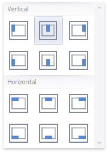

# Legend
A legend is an element of a map that shows values corresponding to each [color](map-coloring.md).

## Visibility
To display a legend within a map, use the **Show Legend** button in the **Legend** group of the **Design** Ribbon tab.

## Position and Orientation
To specify the legend's position and orientation, select one of the predefined options from the gallery in the **Design** Ribbon tab.

