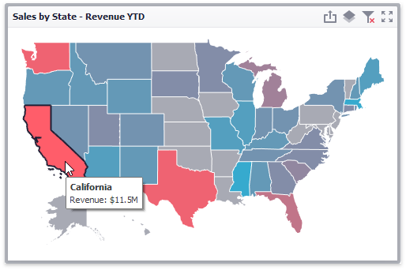

# Map Coloring
The **Choropleth Map** dashboard item colors map shapes depending on the [data provided](providing-data.md).

For instance, you can visualize a sales amount or population density.

## Palette and Scale Settings
The **Choropleth Map** automatically selects palette and scale settings to color map shapes.

If you need to customize these settings, click the **Options** button next to the data item that contains these values.

This invokes the **Choropleth Map Options** dialog.

You can specify the following settings in this window.
* **Color palette** - allows you to specify the start and end color of the palette.
* **Scale settings** - specifies whether a _percent_ scale or an _absolute_ scale is used to define a set of colors. You can specify the number of levels that represent the number of colors used to color the map.
* **Preview** is used to display a full set of palette colors generated based on the start/end colors and the number of levels. Use the **Allow Edit** check box to automatically change the generated colors or specify value ranges for each color.

To learn how to display a map legend, see [Legend](legend.md).

Also, the Choropleth Map allows you to visualize the difference between the _actual_ and _target_ values of a particular parameter. To learn more, see the [Delta](map-coloring/delta.md) topic.