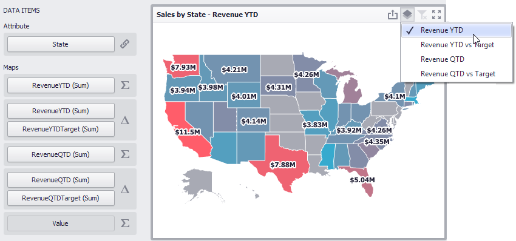

# Providing Data
The Dashboard Designer allows you to bind various dashboard items to data in a virtually uniform manner. To learn more, see the [Bind Dashboard Items to Data](../../bind-dashboard-items-to-data.md) topic.

The only difference is in the data sections that the required dashboard item has. This topic describes how to bind a **Choropleth Map** dashboard item to data in the Designer.

The image below shows a sample Choropleth Map dashboard item that is bound to data.

To bind the Choropleth Map dashboard item to data, drag and drop a data source field to a placeholder contained in one of the available data sections. 
The Choropleth Map provides two data item groups for data binding: DATA ITEMS and TOOLTIP DATA ITEMS.
Tables below list the available data sections.

**DATA ITEMS**
* **Attribute** - 
	Allows you to associate map shapes with data source field values.
	
	To associate map shapes with data source field values, drag-and-drop the required dimension to the data item's placeholder and select the required attribute in the **Map Attribute Binding** dialog. To invoke this dialog, click the _[Options](../../ui-elements/data-items-pane.md)_ button (the  icon) next to the **Attribute** placeholder.
	
	
	
	Select the required attribute and click **OK**.
* **Maps** -
	Contains data items whose values are used to color map shapes. Map shape colors vary based on the map type.
	
	Click the _[Options](../../ui-elements/data-items-pane.md)_ button (the  or  icon depending on the map type) next to the **Value** placeholder and select the required map type in the invoked **Choropleth Map Options** dialog.
	
	
	* If you select **Value**, the Choropleth map colors map shapes depending on the values provided. To learn more, see [Map Coloring](map-coloring.md).
	* If you select **Delta**, the Choropleth map colors map shapes depending on the difference between two values. To learn how to specify delta indication settings, see [Delta](map-coloring/delta.md).
	
	> [!NOTE]
	> You can fill several data item containers in the **Maps** section and use the **Values** drop-down menu to switch between the provided values. To invoke the **Values** menu, click the  icon in the dashboard item caption.

**TOOLTIP DATA ITEMS**
* **Measures** -
	Allows you to add supplementary content to the tooltips. Drag and drop the required measures to provide additional data.