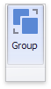

# Dashboard Item Group
DevExpress Dashboard provides the capability to combine dashboard items into a group. The dashboard item group serves two main purposes.
* Combine dashboard items within the dashboard into a separate [layout group](../dashboard-layout/dashboard-items-layout.md).
* Manage [interaction](../interactivity/master-filtering.md) between dashboard items within and outside the group.

For instance, you can combine related [filter elements](filter-elements.md) and [data visualization dashboard items](../add-dashboard-items.md) into a group.

* [Create a Group](#create-a-group)
* [Interactivity](#interactivity)

## <a name="create-a-group"/>Create a Group
To create a new group, use the **Group** button in the **Home** ribbon tab.

You can add dashboard items to a group and manage item layout using [drag-and-drop](../dashboard-layout/dashboard-items-layout.md). To learn how to manage a group's caption, see the [Dashboard Item Caption](../dashboard-layout/dashboard-item-caption.md) topic.

> [!NOTE]
> Note that a dashboard item group cannot be added to another group.

## <a name="interactivity"/>Interactivity
The dashboard item group provides the capability to manage [interaction](../interactivity/master-filtering.md) between dashboard items within and outside the group.

The **Master Filter** button allows you to specify whether the current group allows you to filter external dashboard items using master filter items contained within the group.  If this option is disabled, master filter items contained within the group can filter only dashboard items from this group.****

The **Ignore Master Filters** button allows you to isolate dashboard items contained within the group from being filtered using external master filter items.