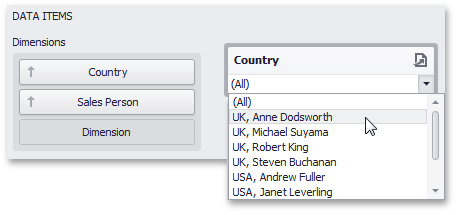

# Providing Data
This topic describes how to bind filter elements to data using the **Dashboard Designer**.

The Dashboard Designer allows you to bind various dashboard items to data in a consistent manner (see [Bind Dashboard Items to Data](../../bind-dashboard-items-to-data/bind-dashboard-items-to-data.md) for details), the only difference being the data sections that these dashboard items comprise.

## Binding Overview
All filter elements provide the **Dimensions** data section, which accepts dimensions used to provide filter values.

To learn about the specifics of binding various filter elements to data, see the table below.

| Dashboard Item | Data Sections | Description |
|---|---|---|
| **Combo Box** |  | The Combo Box filter element can contain several dimensions at the **Dimensions** data section. In this case, the drop-down list will contain combinations of dimension values. |
| **List Box** |  | The List Box filter element can contain several dimensions at the **Dimensions** data section. In this case, the list will contain combinations of dimension values. |
| **Tree View** |  | The Tree View filter element allows you to display dimension values in a hierarchical way. This can be the set of dimensions with different [group intervals](../../data-shaping/grouping.md) (for instance, Year/Quarter/Month) or the set of related dimensions (for instance, geographical data such as continents/countries/cities). |