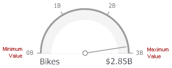
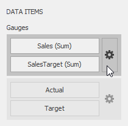
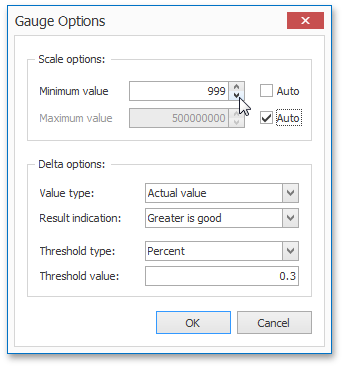
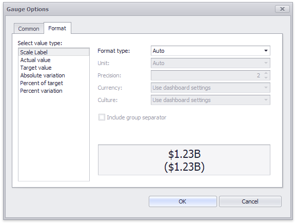

# Gauge Scale
By default, the Gauge dashboard item automatically determines the range of the gauge scales based on the values they display.

You can override this behavior and specify the maximum and minimum values on the scale.

To do this, invoke the **Gauge Options** window using the **Options** button displayed in the data item container in the Gauges section of the DATA ITEMS pane.

In the **Gauge Options** window, uncheck the **Auto** check box for the maximum or minimum value, and specify this value in the corresponding field.

The **Format** tab allows you to specify the numeric display formats for for different value types, as described in the [Formatting Data](../../data-shaping/formatting-data.md) document.

The tab contains the following settings.

* **Format type** - Specifies format types for numeric values. 
* **Unit** - Specifies the unit to convert the numeric values.
* **Precision** - Specifies the number of fractional digits to display.
* **Currency** - Specifies the currency symbol and format provided by the current culture settings.
* **Culture** - Specifies the name of a culture that defines the currency symbol and format.
* **Include group separator** - Specifies whether separators should be inserted between digit groups.
