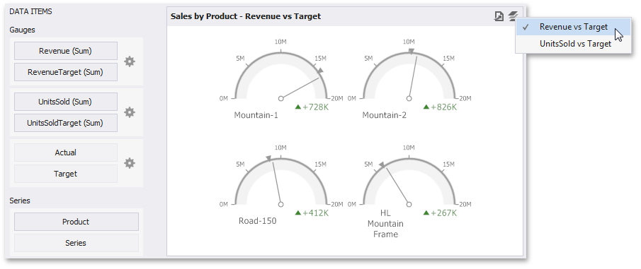

# Providing Data
The Dashboard Designer allows you to bind various dashboard items to data in a virtually uniform manner. To learn more, see the [Bind Dashboard Items to Data](../../bind-dashboard-items-to-data.md) topic.

The only difference is in the data sections that the required dashboard item has. This topic describes how to bind a **Gauge** dashboard item to data in the Designer.

The image below shows a sample Gauge dashboard item that is bound to data.

To bind the Gauge dashboard item to data, drag and drop a data source field to a placeholder contained in one of the available data sections. A table below lists and describes Gauge's data sections.

| Section | Description |
|---|---|
| **Gauges** | Contains data items used to calculate values displayed by gauges. Data items are arranged in containers. Each _[data item container](../../ui-elements/data-items-pane.md)_ can hold two data items. The first item contains _actual_ data and the second item (optional) contains _target_ data. If both items are provided, gauges show the difference between actual and target values. You can fill several data item containers in the Gauges section and use the **Values** drop-down menu to switch between the provided values. To invoke the **Values** menu, click the  icon in the dashboard item caption. This drop-down menu is available if the Series section is not empty. Otherwise, a separate gauge is created for each data item container, and all gauges are displayed simultaneously. |
| **Series** | Contains data items whose values are used to label gauges. |