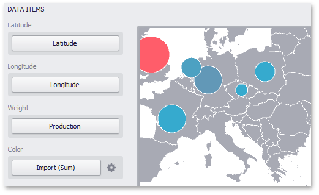

# Providing Data
This topic describes how to bind the **Bubble Map** dashboard item to data using the **Dashboard Designer**.

The Dashboard Designer allows you to bind various dashboard items to data in a virtually uniform manner (see [Bind Dashboard Items to Data](../../../bind-dashboard-items-to-data/bind-dashboard-items-to-data.md) for details). The only difference is in the data sections that these dashboard items have.

The image below shows a sample Bubble Map dashboard item that is bound to data.

Note that the Bubble Map provides two data item groups for data binding: DATA ITEMS and TOOLTIP DATA ITEMS.
Tables below list the available data sections.

**DATA ITEMS**
* **Latitude** - Accepts a dimension used to provide geographic latitude.
* **Longitude** - Accepts a dimension used to provide geographic longitude.
* **Weight** - Accepts a measure used to evaluate the bubble's weight.
* **Color** - Accepts a measure used to evaluate the bubble's color.
	
	The Bubble Map dashboard item automatically selects palette and scale settings used to color bubbles. To customize these settings, click the **Options** button next to the **Color** placeholder. This invokes the **Color Scale Options** dialog, which allows you to specify the palette and scale options. To learn how to use this dialog, see [Coloring](coloring.md).

**TOOLTIP DATA ITEMS**
* **Dimensions** - Accepts dimensions allowing you to add supplementary content to the tooltips.
* **Measures** - Accepts measures allowing you to add summaries to the tooltips.