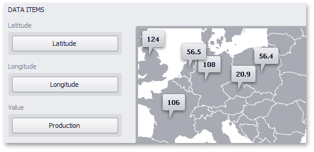

# Providing Data
This topic describes how to bind the **Geo Point Map** dashboard item to data using the **Dashboard Designer**.

The Dashboard Designer allows you to bind various dashboard items to data in a virtually uniform manner (see [Bind Dashboard Items to Data](../../../bind-dashboard-items-to-data/bind-dashboard-items-to-data.md) for details). The only difference is in the data sections that these dashboard items have.

The image below shows a sample Geo Point Map dashboard item that is bound to data.

Note that the Geo Point Map provides two data item groups for data binding: DATA ITEMS and TOOLTIP DATA ITEMS.
Tables below list the available data sections.

**DATA ITEMS**

| Section | Description |
|---|---|
| **Latitude** | Accepts a dimension used to provide geographic latitude. |
| **Longitude** | Accepts a dimension used to provide geographic longitude. |
| **Value** | Accepts values related to geographic points. These values are displayed within map callouts. |

**TOOLTIP DATA ITEMS**

| Section | Description |
|---|---|
| **Dimensions** | Accepts dimensions allowing you to add supplementary content to the tooltips. |
| **Measures** | Accepts measures allowing you to add summaries to the tooltips. |