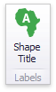
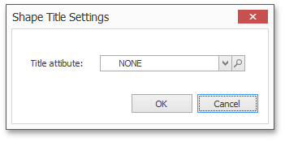

# Labels
Geo Point maps provide the capability to display titles within map shapes and allows you to add supplementary content to the callout/bubble/pie tooltips.

## Shape Titles
To manage map titles, click the **Shape Title** button in the **Design** ribbon tab.

This invokes the **Shape Title Settings** dialog.

In this dialog, you can specify attributes whose values will be displayed within shapes. Use the  button to preview the available attributes and their values for the current map.

The **Title attribute** option allows you to select the attribute whose values are displayed within corresponding map shapes.

## Tooltips
Geo Point maps also allow you to add supplementary content to the callout/bubble/pie tooltips using the TOOLTIP DATA ITEMS area. To learn more, see the Tooltip Data Items paragraph in the [Providing Data](geo-point-map/providing-data.md) topic.