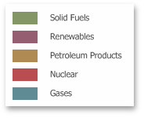
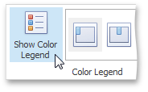
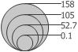
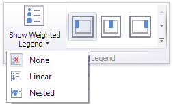
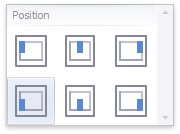

# Legends
The Pie Map provides two types of legends used to identify map objects - color and weighted legends.
* [Color Legend](#color)
* [Weighted Legend](#weighted)

## <a name="color"/>Color Legend
The color legend helps you to identify which colors correspond to specific argument values.

To display a color legend within a map, use the **Show Color Legend** button in the **Color Legend** section of the **Design** Ribbon tab.

To specify the legend's position and orientation, select one of the predefined options from the gallery in the **Design** Ribbon tab.

## <a name="weighted"/>Weighted Legend
The weighted legend allows you to identify values corresponding to specific pie sizes.

> [!NOTE]
> The Pie Map dashboard item does not display the weighted legend if [weighed pies](pie-options.md) are disabled.

To select the required weighted legend type, use the **Show Weighted Legend** button in the **Weighted Legend** section of the **Design** Ribbon tab.

To specify the legend's position, select one of the predefined options from the gallery in the **Design** Ribbon tab.

