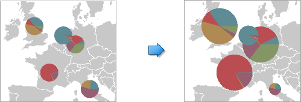
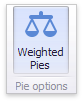

# Pie Options
The Pie Map dashboard item allows you to take into account the weight of pies. In this case, the relative sizes of the pies depend on the corresponding summary values.

To enable this capability, use the **Weighted Pies** button in the **Design** ribbon tab.

