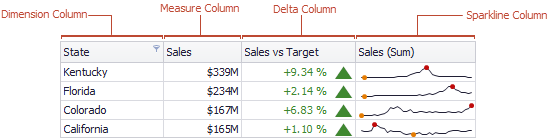
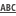
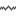
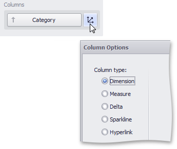

# Column Type Overview
The **Grid** dashboard item supports four types of columns.
* [Dimension Column](dimension-column.md)
	
	Displays values in the bound data item "as is".
* [Hyperlink Column](hyperlink-column.md)
	
	Allows you to display hyperlinks in the Grid dashboard item.
* [Measure Column](measure-column.md)
	
	Displays summaries calculated against data in the bound data item.
* [Delta Column](delta-column.md)
	
	Bound to two measures, it calculates summaries for both measures, and displays the difference between these summaries.
* [Sparkline Column](sparkline-column.md)
	
	Displays values in the bound data item using sparklines.

When you drop a data item into the **Columns** section, the type for the new column is determined automatically, based on the data type.

## Column Type Indication
The type of the column is indicated within the corresponding data item container in the DATA ITEMS area.

Column type indicators are defined as follows:

| Icon | Column Type |
|---|---|
|  | [Dimension Column](dimension-column.md) |
|  | [Hyperlink Column](hyperlink-column.md) |
|  | [Measure Column](measure-column.md) |
|  | [Delta Column](delta-column.md) |
|  | [Sparkline Column](sparkline-column.md) |

## Changing Column Type
To change the column type, click the column type indicator. In the invoked **Column Options** window, select the required column type in the **Column type** section.

