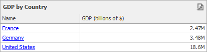
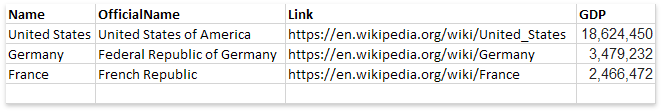
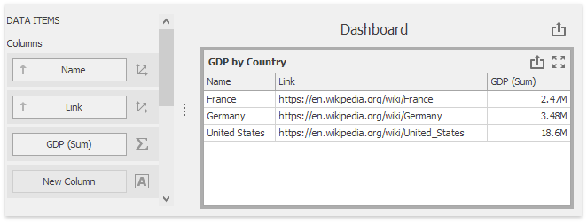
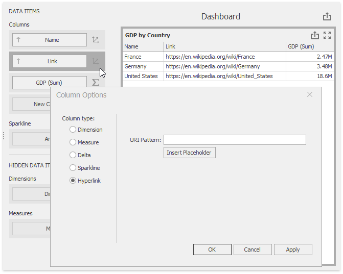
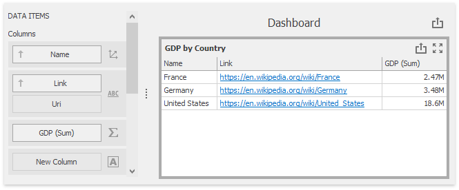
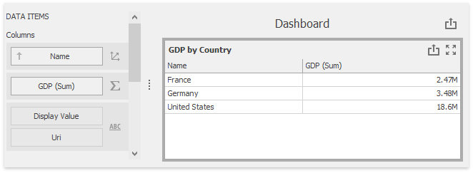
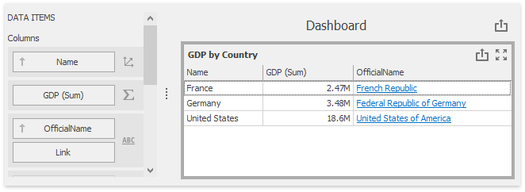
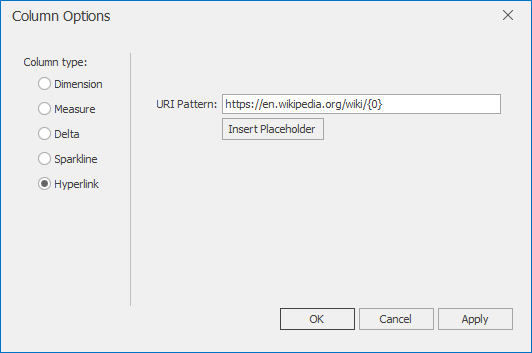
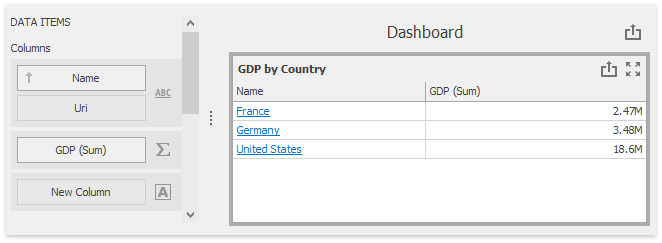

# Hyperlink Column

A _hyperlink_ column allows you to display hyperlinks in the Grid dashboard item.



You can provide hyperlinks as a separate data column. or they can be automatically created at run-time from any column using the specified **URI pattern**.

In this document, the sample data source contains four fields: country name, official country name, Wikipedia country page's URI and the GDP value.



The following sections describe how to create hyperlink columns in more detail:

- [Data Field Containing Uri Values](#data-field-containing-uri-values)
- [Uri Pattern](#uri-pattern)

## Data Field Containing Uri Values

Drag the _Name_ data field from the Data Source tree view to the column's [data item container](../../../bind-dashboard-items-to-data/bind-dashboard-items-to-data.md). The data field is automatically processed as [dimension](dimension-column.md). Drag and drop the GDP data field to another column's data item container. The data field is recognized as [measure](measure-column.md) and summarized.


[Drop](../../../bind-dashboard-items-to-data/bind-dashboard-items-to-data.md) the _Link_ field between the _Name_ and the _GDP (Sum)_ data items. The Grid recognizes this field as **dimension** and displays links as plain text.



Click the [Column Type Indicator](column-type-overview.md) button next to the _Name_ data item and change its type to **Hyperlink**.



The Grid displays column values as clickable hyperlinks allowing you to navigate to the Wiki's pages.



You can bind the Display value and URI value to different data fields. Click the _New Column_ data item placeholder and change its type to **Hyperlink**.



Drag and drop the _OfficialName_ field to the _Display Value_ data item placeholder to display official country names. Drag and drop the _Link_ field to the _Uri_ data item placeholder to specify URIs.

The grid displays official country names with links obtained from the _Link_ data source field.



## Uri Pattern
In this case, a specified URI pattern is used to generate links.

Drag the _Name_ data field from the Data Source tree view to the column's [data item container](../../../bind-dashboard-items-to-data/bind-dashboard-items-to-data.md). The data field is automatically processed as [dimension](dimension-column.md). Drag and drop the GDP data field to another column's data item container. The data field is recognized as [measure](measure-column.md) and summarized.


Click the [Column Type Indicator](column-type-overview.md) button next to the Name data item and change its type to **Hyperlink**. Specify the **URI Pattern** option as follows:

```https://en.wikipedia.org/wiki/{0}```



The ```{0}``` placeholder is replaced with the _Name_ data item value. The links are generated for country names and displayed in the grid as illustrated in the following picture.

