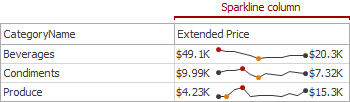
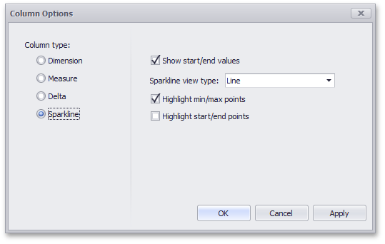

# Sparkline Column
A **sparkline column** visualizes the variation in summary values over time.

## Data Binding Specifics
The sparkline column is bound to a measure providing sparkline values and to a dimension providing a date-time interval.

## Sparkline Options
You can control sparkline appearance settings using the **Column Options** dialog. To invoke this dialog, click the column type indicator ().

In this dialog, you can control various settings that affect how the sparkline is displayed within a grid cell.

| Sparkline Options | Description |
|---|---|
| Show start/end values | Species whether or not to display sparkline start/end values within a grid cell. |
| Sparkline view type | Defines the view type of a sparkline. Sparkline view types include **Line**, **Area**, **Bar**, and **Win/Loss**. |
| Highlight min/max points | Specifies whether or not to highlight the minimum/maximum points of a sparkline. |
| Highlight start/end points | Specifies whether or not to highlight the start/end points of a sparkline. |