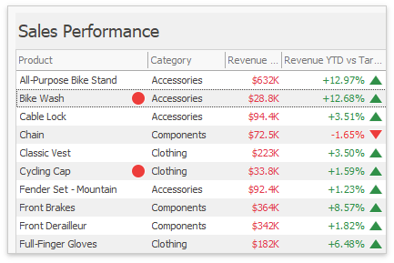

# Conditional Formatting
A Grid dashboard item applies conditional formatting to data items that supply data to the [dimension](columns/dimension-column.md) and [measure](columns/measure-column.md) column types. 

You can use [hidden measures](../../bind-dashboard-items-to-data/hidden-data-items.md) to specify a condition used to apply formatting to visible values.

## Supported Format Rules

The following list contains available format rules and corresponding data types:
* numeric
	* [Value](../../appearance-customization/conditional-formatting/value.md)
	* [Top-Bottom](../../appearance-customization/conditional-formatting/top-bottom.md)
	* [Average](../../appearance-customization/conditional-formatting/average.md)
	* [Expression](../../appearance-customization/conditional-formatting/expression.md)
	* [Icon Ranges](../../appearance-customization/conditional-formatting/icon-ranges.md)
	* [Color Ranges](../../appearance-customization/conditional-formatting/color-ranges.md)
	* [Gradient Ranges](../../appearance-customization/conditional-formatting/gradient-ranges.md)
	* [Bar](../../appearance-customization/conditional-formatting/bar.md) 
	* [Bar Color Ranges](../../appearance-customization/conditional-formatting/bar-color-ranges.md) 
	* [Bar Gradient Ranges](../../appearance-customization/conditional-formatting/bar-gradient-ranges.md) 
* string 
	* [Value](../../appearance-customization/conditional-formatting/value.md) (with a condition type set to _Equal To_, _Not Equal To_ or _Text that Contains_)
	* [Expression](../../appearance-customization/conditional-formatting/expression.md)
* date-time
	* [Value](../../appearance-customization/conditional-formatting/value.md)
	* [A Date Occurring](../../appearance-customization/conditional-formatting/value.md) (for dimensions with a continuous date-time group interval)
	* [Expression](../../appearance-customization/conditional-formatting/expression.md)
	* [Icon Ranges](../../appearance-customization/conditional-formatting/icon-ranges.md)
	* [Color Ranges](../../appearance-customization/conditional-formatting/color-ranges.md)
	* [Gradient Ranges](../../appearance-customization/conditional-formatting/gradient-ranges.md)
	* [Bar](../../appearance-customization/conditional-formatting/bar.md) 
	* [Bar Color Ranges](../../appearance-customization/conditional-formatting/bar-color-ranges.md) 
	* [Bar Gradient Ranges](../../appearance-customization/conditional-formatting/bar-gradient-ranges.md) 

## Create and Edit a Format Rule

You can create and edit format rules in the following ways:

* Click the **Edit Rules** button on the **Home** ribbon tab. 

* Click the measure/dimension menu button in the Data Item's pane and select **Add Format Rule**/**Edit Rules**. 

Refer to the following topic for information on how to create and edit format rules: [Conditional Formatting Common](../../appearance-customization/conditional-formatting.md).

## Grid-Specific Format Condition Settings

Specify appearance settings and set the condition's value for the format rule. Available settings depend on the selected format rule. The image below displays the **Greater Than** dialog, which corresponds to the [Value](../../appearance-customization/conditional-formatting/value.md) format condition for a Grid dashboard item. The format condition applies to the _ExtendedPrice_ data item in the **Apply to** drop-down list.

The **Apply to row** check box allows you to specify whether to apply the formatting to the entire grid row.

You can configure and customize current format condition appearance settings.

* Choose a predefined background color/font or click an empty square to add a new preset in the **Appearance** tab.

	

* Add a predefined icon in the **Icons** tab.	

