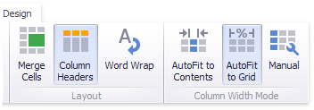
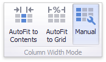
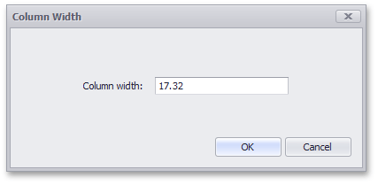
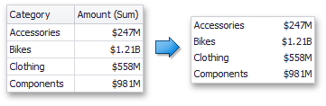

# Layout
The Grid dashboard item allows you to customize its layout in various ways. You can manage the width of grid columns, specify the visibility of column headers, enable cell merging, etc.

To do this, use the **Layout** and **Column Width Mode** groups in the **Design** Ribbon tab.

* [Column Width Modes](#column-width-modes)
* [Column Header](#column-header)
* [Cell Merging](#cell-merging)
* [Word Wrapping](#word-wrapping)

## <a name="column-width-modes"/>Column Width Modes
The Grid dashboard item allows you to manage column widths using different modes. Use buttons in the **Column Width Mode** group to manage the column width modes.

The following modes are available.

### AutoFit to Contents

The grid adjusts columns to the minimum width required to completely display their content automatically. If the entire content cannot be displayed within the dashboard item, horizontal scrolling is enabled..

### AutoFit to Grid

The grid adjusts the width of all columns to fit their content in an optimal way. If you are changing the size of the dashboard item, the width of columns is changed proportionally..

### Manual

The grid allows you to adjust column widths manually.

In this mode, you can adjust the width of individual columns in the following ways.
* Specify the width of  the required column by dragging the right edge of the column header.
	
	
	
	In this case, all columns preserve their relative size when the grid width is changed.
* Specify the column width and fix it by right-clicking the required column header and selecting **Fix Width**.
	
	
	
	You can also specify the fixed column width by selecting **Column Width...** This invokes the **Column Width** window that allows you to specify the width of the column in characters.
	
	
* Fit the column width to its content and fix it by right-clicking the required column header and selecting **Fit to Content**.

## <a name="column-header"/>Column Header
Use the **Column Headers** button to toggle column header visibility.

## <a name="cell-merging"/>Cell Merging
The Grid allows you to merge neighboring cells with identical values . To do this, use the **Merge Cells** button.

> [!NOTE]
> Note that [banded rows](style.md) are not available when cell merging is enabled.

## <a name="word-wrapping"/>Word Wrapping
The word wrapping feature enables the capability to display cell content on multiple lines if the size of a dashboard item is insufficient to completely display the cell content on a single line.

> [!NOTE]
> The word wrapping feature is not in effect when the **AutoFit to Contents** [column width mode](#column-width-modes) is enabled.