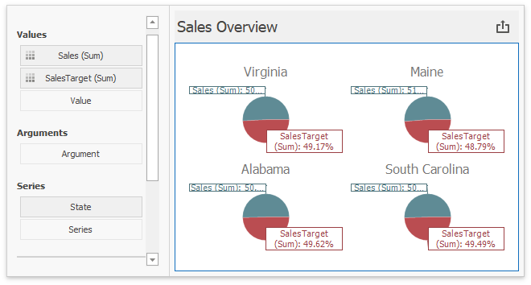
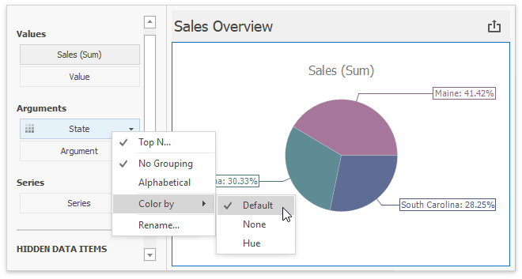

# Coloring
In **Default** color mode, the Pie dashboard item colors its segments in the following way:

* If the Pie dashboard item contains measures (the **Values** section) and series dimensions (the **Series** section), only values corresponding to different measures are colored by [hue](../../appearance-customization/coloring/coloring-concepts.md).

    

* If the Pie dashboard item contains arguments (the **Arguments** section), different argument values are colored by hue.

    

>[!Tip]
>**Documentation:** 
>* [Coloring Basics](../../appearance-customization/coloring.md)    