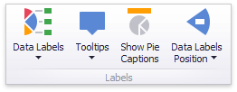

# Labels

You can specify which information should be displayed within data labels and tooltips. To do this, use the **Data Labels** and **Tooltips** buttons in the **Labels** group of the **Design** Ribbon tab.

These buttons invoke a drop-down menu that is similar for both buttons. This menu allows you to specify which values are displayed within data labels or tooltips.

