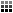

# Coloring
The Range Filter dashboard item paints different measures and series dimensions by [hue](../../appearance-customization/coloring/coloring-concepts.md) in **Default** color mode. The image below shows the Range Filter item whose _State_ series dimension values are painted in different colors. A special icon () on the data item shows that color variation is enabled.

>[!Tip]
>**Documentation:** 
>* [Coloring Basics](../../appearance-customization/coloring.md)

