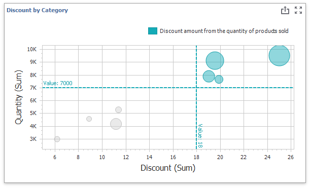
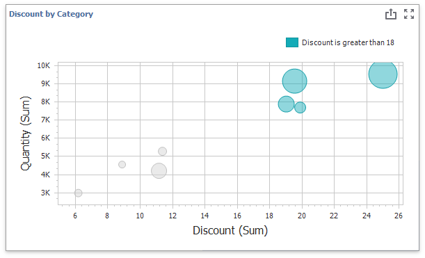
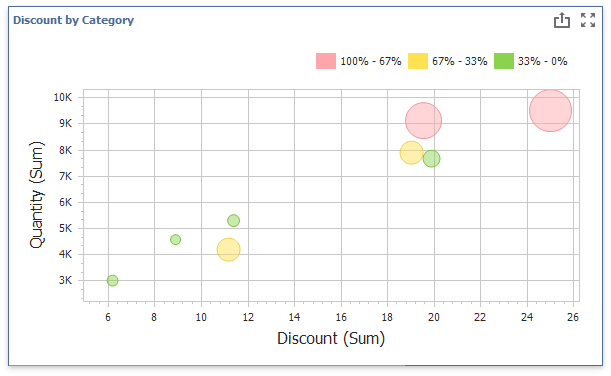

# Conditional Formatting

Use conditional formatting to highlight points in a Scatter Chart dashboard item.

## Supported Format Rules

You can use the following data in rule calculations:

- [measures](../../bind-dashboard-items-to-data/bind-dashboard-items-to-data.md) from the **X and Y axis** sections 
- [measures](../../bind-dashboard-items-to-data/bind-dashboard-items-to-data.md) from the **Weight** section
- [dimensions](../../bind-dashboard-items-to-data/bind-dashboard-items-to-data.md) from the **Arguments** section 
- hidden measures 

The following list contains available format rules and corresponding data types:

* numeric
	* [Value](../../appearance-customization/conditional-formatting/value.md)
	* [Top-Bottom](../../appearance-customization/conditional-formatting/top-bottom.md)
	* [Average](../../appearance-customization/conditional-formatting/average.md)
	* [Expression](../../appearance-customization/conditional-formatting/expression.md)
	* [Color Ranges](../../appearance-customization/conditional-formatting/color-ranges.md)
	* [Gradient Ranges](../../appearance-customization/conditional-formatting/gradient-ranges.md)
* string 
	* [Value](../../appearance-customization/conditional-formatting/value.md) (with a condition type set to _Equal To_, _Not Equal To_ or _Text that Contains_)
	* [Expression](../../appearance-customization/conditional-formatting/expression.md)
* date-time
	* [Value](../../appearance-customization/conditional-formatting/value.md)
	* [A Date Occurring](../../appearance-customization/conditional-formatting/value.md) (for dimensions with a continuous date-time group interval)
	* [Expression](../../appearance-customization/conditional-formatting/expression.md)
	* [Color Ranges](../../appearance-customization/conditional-formatting/color-ranges.md)
	* [Gradient Ranges](../../appearance-customization/conditional-formatting/gradient-ranges.md)

## Create and Edit a Format Rule

You can create and edit format rules in the following ways:

* Click the **Edit Rules** button on the **Home** ribbon tab. 

* Click the measure/dimension menu button in the Data Item's pane and select **Add Format Rule**/**Edit Rules**. 

Refer to the following topic for information on how to create and edit format rules: [Conditional Formatting Common](../../appearance-customization/conditional-formatting.md).

## Format Condition Settings Specific to Scatter Charts

Specify appearance settings and set the condition's value to create a format rule. Available settings depend on the selected format condition type.

The image below displays the **Greater Than** dialog (a [Value](../../appearance-customization/conditional-formatting/value.md) format condition applied to a scatter chart). The condition colors bubbles if their values exceed 18.

If you enable **Display in Legend**, the chart shows information about the applied rule. Set the **Caption** field to specify the legend's text.
The image below displays the Scatter Chart item with the applied **Greater Than** format rule. The **Display in Legend** option is activated and the rule's caption is displayed in the legend:

For Range format rules, the legend display text is generated automatically and depends on the range intervals:

## Coloring 

A Scatter Chart item paints elements in pale gray if they do not meet the applied format condition. Note that this does not apply to elements that use the [Hue](coloring.md) color mode.

Select the **Color by Hue** option in a Data item's pane to restore the color scheme. 

> [!Tip]
> **Documentation:**
> [Scatter Chart - Coloring](coloring.md)
