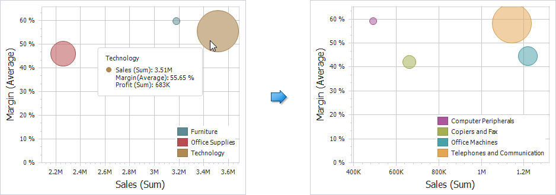

# Drill-Down
The built-in drill-down capability allows you to change the detail level of data displayed in dashboard items on the fly. To learn more about drill-down concepts common to all dashboard items, see the [Drill-Down](../../../interactivity/drill-down.md) topic.

When drill-down is enabled, you can click a point to view the details.

> [!NOTE]
> When [Master Filtering](../../../interactivity/master-filtering.md) is enabled, you can view the details by double-clicking a point.

Drill-down requires that the **Arguments** section contain several dimensions, from the least to the most detailed dimension.

> [!NOTE]
> In OLAP mode, you can perform drill-down for either a hierarchy data item or several dimension attributes. To learn more about OLAP mode, see [Bind Dashboard Items to Data in OLAP mode](../../../bind-dashboard-items-to-data/bind-dashboard-items-to-data-in-olap-mode.md).

To enable drill-down, click the **Drill Down** button in the **Data** Ribbon tab (or the  button if you are using the toolbar menu).

To return to the previous detail level (drill up), use the **Drill Up** () button in the caption of the Scatter Chart dashboard item, or the **Drill Up** command in the context menu.