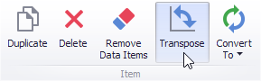

# Providing Data
The Dashboard Designer allows you to bind various dashboard items to data in a virtually uniform manner. To learn more, see the [Bind Dashboard Items to Data](../../bind-dashboard-items-to-data.md) topic.

The only difference is in the data sections that the required dashboard item has. This topic describes how to bind a **Scatter Chart** dashboard item to data in the Designer.
* [Binding to Data in the Designer](#bindingdesigner)
* [Transposing X- and Y-axis](#transposing)

## <a name="bindingdesigner"/>Binding to Data in the Designer
The image below shows a sample Scatter Chart dashboard item that is bound to data.

To bind the Scatter Chart dashboard item to data, drag and drop a data source field to a placeholder contained in one of the available data sections. A table below lists and describes Scatter Chart data sections.

| Section | Description |
|---|---|
| **X-Axis** | Contains the data item against which the X-coordinates of data points are calculated. |
| **Y-Axis** | Contains the data item against which the Y-coordinates of data points are calculated. |
| **Weight** | Contains the data item whose values are used to calculate the weight of data points. |
| **Arguments** | Contains data items providing scatter chart arguments that are used to create data points. |

## <a name="transposing"/>Transposing X- and Y-axis
The Scatter Chart dashboard item provides the capability to transpose its axes. In this case, the data item contained in the **X-Axis** section is moved to the **Y-Axis** section, and vice versa.

To transpose the selected Scatter Chart dashboard item, use the **Transpose** button in the **Home** ribbon tab.

