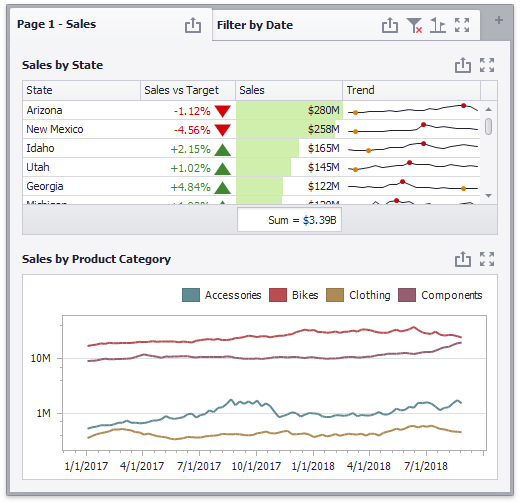
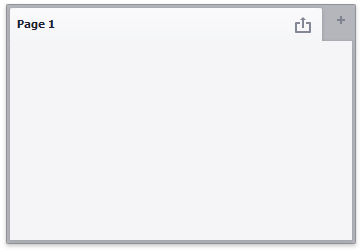
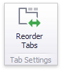
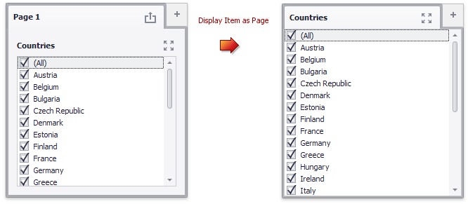
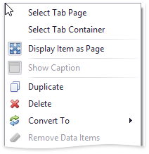

# Tab Container

The **Tab container** dashboard item allows you to split the dashboard layout into several pages. Common filter controls for large elements in a dashboard can be located on a separate tab page.

* [Overview](#overview)
* [Tab Order](#tab-order)
* [Display Item as Page](#display-item-as-page)
* [Selection](#selection)
* [Interactivity](#interactivity)

## Overview
To create a tab container, use the **Tab Container** button in the **Home** ribbon tab:

A newly created tab container contains an empty tab page (_Page 1_).

Click the + (_plus_) icon to add an empty page to the tab container. You can use [drag-and-drop](../dashboard-layout/dashboard-items-layout.md) to add dashboard items to a tab page and manage the layout. Tab containers cannot be nested, so you cannot add a tab container to another tab container. However, a tab container can contain [item groups](dashboard-item-group.md). 

See the [Dashboard Item Caption](../dashboard-layout/dashboard-item-caption.md) topic to learn how to manage a tab container's caption. 

## Tab Order
To change the tab page order, click the **Reorder Tabs** button on the **Tab settings** group.

The **Tabs Order** dialog is invoked. 

Click up and down arrows to change the order of the tab pages in the tab container.

## Display Item as Page

The tab caption is above the caption of the content element on the page. If a tab page contains a single element, the _Display Item as Page_ feature is activated. It merges the dashboard item with a tab page and displays a single caption, as illustrated below.

To disable the _Display Item as Page_ feature, use one of the following methods:
* Select the tab page and click the **Display Item as Page** button in the **Layout** group on the **Design** ribbon tab of the **Page Tools** contextual tab set.

	
* Select the **Display Item as Page** command in the tab page context menu.

## Selection
Click the element's border or use the item's context menu to select a page or a tab container:

## Interactivity
The tab page allows you to manage the [interaction](../interactivity/master-filtering.md) between dashboard items inside and outside the page.

The **Master Filter** button (in the **Interactivity** group on the **Data** ribbon tab of the **Page Tools** contextual tab set) controls whether the current tab page allows you to filter dashboard items outside the page using master filter items contained within the page.  If this button is switched off, master filter items in the page can filter only dashboard items in this page.

> [!Note]
> The default tab page behaves opposite to the default group. While the group isolates filter items from the outside, the tab page does not change the item's data interactivity behavior.

The **Ignore Master Filters** button (in the **Interactivity** group on the **Data** ribbon tab of the **Page Tools** contextual tab set) allows you to isolate dashboard items contained within the page from external master filter items.