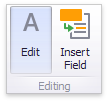

# Editing Text
To edit the text within the Text Box, click the **Edit** button in the ribbon's **Design** tab or use the corresponding item in the context menu.

This adds the **Text Box Editor** context category to the Dashboard Designer's ribbon and allows you to modify the content within the Text Box.

To learn how to edit the content within the Text Box, see [Rich Text Editor](../../../../../interface-elements-for-desktop/articles/rich-text-editor.md). After you change the document, click **Edit** again to finish editing.

> [!NOTE]
> Note that the Text Box can be [bound](../../bind-dashboard-items-to-data.md) to data. To learn how to do this, see [Providing Data](providing-data.md).