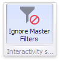

# Interactivity
This document describes the features that enable interaction between the **Text Box** and other dashboard items. These features include **Master Filtering**.

## Master Filtering
The Dashboard allows you to use most of the data-aware dashboard items as a filter for other dashboard items (**Master Filter**). To learn more, see the [Master Filtering](../../interactivity/master-filtering.md) topic, which describes filtering concepts common to all dashboard items.

Data displayed in the Text Box dashboard item can be filtered by other master filter items. For instance, the Text Box below shows data corresponding to a product selected in the [List Box](../filter-elements/filter-elements-overview.md) dashboard item.

You can prevent the Text Box from being affected by other master filter items using the **Ignore Master Filters** button on the **Data** ribbon tab.

