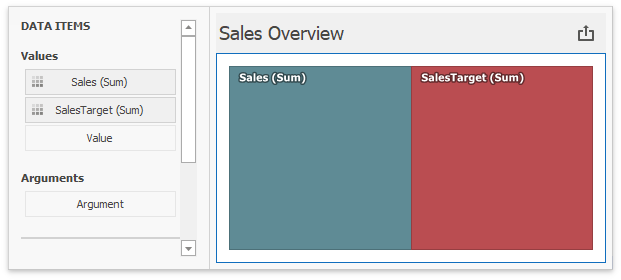
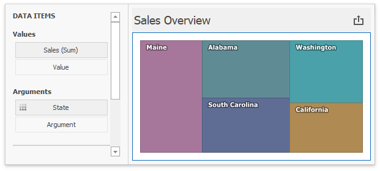

# Coloring
In **Default** color mode, the Treemap dashboard item colors its tiles in the following ways:

* If the Treemap dashboard item contains only measures (the **Values** section), values corresponding to different measures are colored by [hue](../../appearance-customization/coloring/coloring-concepts.md).

    
* If the Treemap dashboard item contains arguments (the **Arguments** section), values corresponding to the first argument are colored by hue.

    

>[!Tip]
>**Documentation:** 
>* [Coloring Basics](../../appearance-customization/coloring.md)      