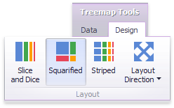
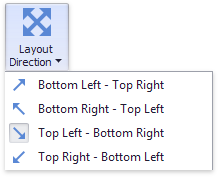

# Layout
This topic describes how to change a layout algorithm used to arrange Treemap tiles. To do this in the Designer, use buttons from the **Layout** group placed in the **Design** ribbon tab.

The following algorithms are available.

| Algorithm | Example | Description |
|---|---|---|
| **Slice and Dice** |  | This layout algorithm divides the space between items, slicing it in the specified direction depending on item value. |
| **Squarified** |  | The Squarified algorithm arranges tiles so that their width/height ratio will be closer to 1. |
| **Striped** |  | This algorithm is a modified version of the Squarified algorithm. The difference here is that tiles are drawn side by side as columns or rows. |

You can also set a layout direction to specify an arrangement of tiles depending on their sizes. To do this, click the **Layout Direction** button and select the required direction.

* **Bottom Left - Top Right** - Arrange tiles from the bottom-left to the top-right corner.
* **Bottom Right - Top Left** - Arrange tiles from the bottom-right to the top-left corner.
* **Top Left - Bottom Right** - Arrange tiles from the top-left to the bottom-right corner.
* **Top Right - Bottom Left** - Arrange tiles from the top-right to the bottom-left corner.