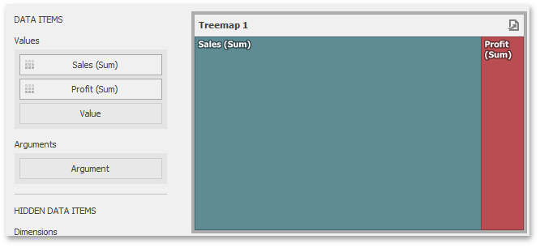
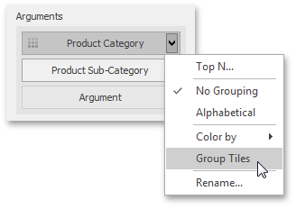
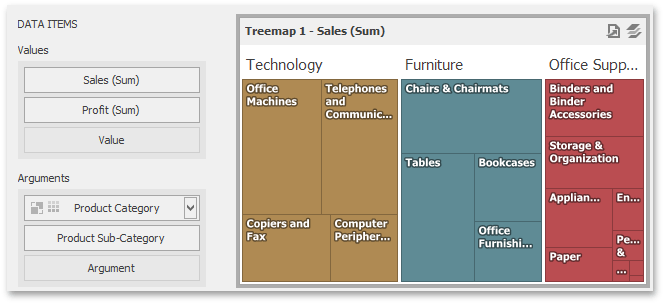

# Providing Data
The Dashboard Designer allows you to bind various dashboard items to data in a virtually uniform manner. To learn more, see the [Bind Dashboard Items to Data](../../bind-dashboard-items-to-data/bind-dashboard-items-to-data.md) topic. The only difference is in the data sections that the required dashboard item has.

The Treemap dashboard item has the **Values** and **Arguments** data sections that provide numeric and discrete categorical data, respectively. The steps below provide the most common scenarios of binding a Treemap to data.
1. Drop the _Sales_ and _Profit_ fields to the **Values** section.
	
	
	
	The Treemap will draw two tiles whose sizes correspond to the _Sales_ and _Profit_ summary values.
2. Drop the _Product Category_ field to **Arguments**.
	
	
	
	Treemap will create individual tiles for all categories. You can switch between _Sales_ and _Profit_ values by clicking the  icon in the item's [caption](../../dashboard-layout/dashboard-item-caption.md) or you can use its context menu.
3. Drop the child _Product Sub-Category_ field into **Arguments**.
	
	
	
	The Treemap will visualize all combinations of categories and corresponding sub-categories using individual tiles.
4. If the **Arguments** section contains several dimensions, you can [group](grouping.md)  child tiles by values of the parent dimension. To group sub-categories inside corresponding categories, click the _CategoryName_ menu button and select **Group Tiles**.
	
	
	
	Sub-category tiles will be grouped into category groups.
	
	