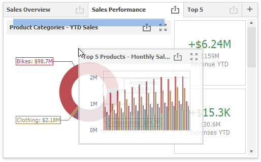

# Dashboard Layout

This topic describes the features related to the dashboard layout in the WinForms Designer.

## Dashboard Width and Height

The control automatically stretches or shrinks content (dashboard items) in a dashboard to fit available screen space. You can adjust the layout options and specify the width and height of content.

In the Ribbon menu, click the **Layout Options** button:

This invokes the **Dashboard Layout Options** dialog that allows you to specify the dashboard width and height:

* _Auto_

    The height or width of a dashboard surface fits to content.
* _Fixed_

    The height or width of a dashboard surface is set in pixels.

## Dashboard Title
The Dashboard Title is located at the top of the dashboard surface. It can contain text, images and command buttons.

See the following article for more information: [Dashboard Title](dashboard-layout/dashboard-title.md).
## Dashboard Items Layout

The Dashboard Designer allows users to arrange and resize dashboard items and groups using drag-and-drop operations.

See the following article for more information: [Dashboard Items Layout](dashboard-layout/dashboard-items-layout.md).
## Dashboard Item Caption
Dashboard Item Caption is located on the dashboard surface and contains relevant up-to-date information and command buttons. 

Refer to the following article for details: [Dashboard Item Caption](dashboard-layout/dashboard-item-caption.md).

